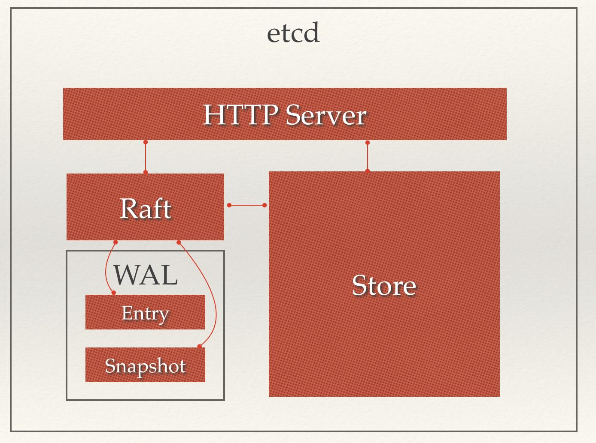
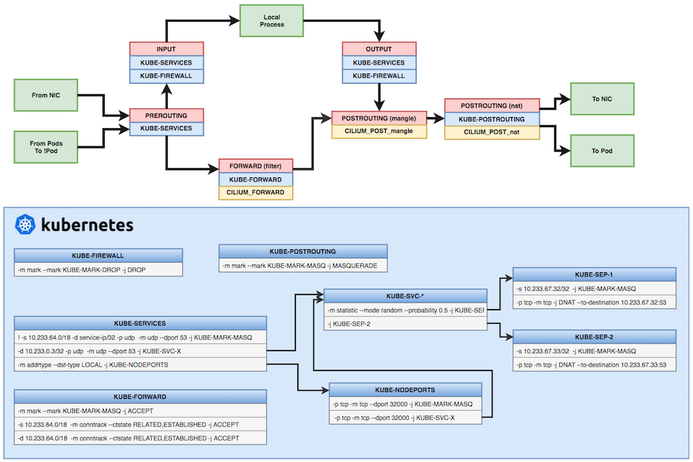

# Kubernetes架构

Kubernetes 的整体架构：


Kubernetes主要由以下几个核心组件组成：

+ etcd 保存了整个集群的状态；
+ apiserver 提供了资源操作的唯一入口，并提供认证、授权、访问控制、API注册和发现等机制；
+ controller manager 负责维护集群的状态，比如故障检测、自动扩展、滚动更新等；
+ scheduler 负责资源的调度，按照预定的调度策略将Pod调度到相应的机器上；
+ kubelet 负责维护容器的生命周期，同时也负责Volume（CSI）和网络（CNI）的管理；
+ Container runtime 负责镜像管理以及Pod和容器的真正运行（CRI），常用的是 docker；
+ kube-proxy 负责为 Service 提供 cluster 内部的服务发现和负载均衡；

除了核心组件，还有一些推荐的插件：

+ kube-dns 负责为整个集群提供DNS服务
+ Ingress Controller 为服务提供外网入口
+ Heapster 提供资源监控
+ Dashboard 提供 GUI
+ Federation 提供跨可用区的集群

## 组件通信

Kubernetes 组件之间的通信原理为：

+ apiserver 负责 etcd 存储的所有操作，且只有 apiserver 才直接操作 etcd 集群;
+ apiserver 对内（集群中的其他组件）和对外（用户）提供统一的 REST API，其他组件均通过 apiserver 进行通信
+ controller manager、scheduler、kube-proxy 和 kubelet 等均通过 apiserver watch API 监测资源变化情况，并对资源作相应的操作
+ 所有需要更新资源状态的操作均通过 apiserver 的 REST API 进行
+ apiserver 也会直接调用 kubelet API（如 logs, exec, attach 等），默认不校验 kubelet 证书，但可以通过 --kubelet-certificate-authority 开启（而 GKE 通过 SSH 隧道保护它们之间的通信）

典型的创建 Pod 的流程为：


+ 用户通过 REST API 创建一个 Pod
+ apiserver 将其写入 etcd
+ scheduluer 检测到未绑定 Node 的 Pod，开始调度并更新 Pod 的 Node 绑定
+ kubelet 检测到有新的 Pod 调度过来，通过 container runtime 运行该 Pod
+ kubelet 通过 container runtime 取到 Pod 状态，并更新到 apiserver 中

## Etcd

Etcd 是基于 Raft 的分布式 key-value 存储系统，由 CoreOS 开发，常用于服务发现、共享配置以及并发控制（如 leader 选举、分布式锁等）。

Etcd 主要功能：
+ 基本的 key-value 存储
+ 监听机制
+ key 的过期及续约机制，用于监控和服务发现
+ 原子 CAS 和 CAD，用于分布式锁和 leader 选举

Etcd 用于保存集群所有的网络配置和对象的状态信息：

+ 网络插件flannel、对于其它网络插件也需要用到etcd存储网络的配置信息
+ kubernetes本身，包括各种对象的状态和元信息配置

etcd 架构图：



## API Server

kube-apiserver 是 Kubernetes 最重要的核心组件之一，主要提供以下的功能：

+ 提供集群管理的 REST API 接口，包括认证授权、数据校验以及集群状态变更等
+ 提供其他模块之间的数据交互和通信的枢纽（其他模块通过 API Server 查询或修改数据，只有 API Server 才直接操作 etcd）

kube-apiserver 支持同时提供 https（默认监听在 6443 端口）和 http API（默认监听在 127.0.0.1 的 8080 端口），其中 http API 是非安全接口，不做任何认证授权机制，不建议生产环境启用。

## kube-scheduler

kube-scheduler 负责分配调度 Pod 到集群内的节点上，它监听 kube-apiserver，查询还未分配 Node 的 Pod，然后根据调度策略为这些 Pod 分配节点（更新 Pod 的 NodeName 字段）。

调度器需要充分考虑诸多的因素：
+ 公平调度
+ 资源高效利用
+ QoS
+ affinity 和 anti-affinity
+ 数据本地化（data locality）

## Controller Manager

Controller Manager 由 kube-controller-manager 和 cloud-controller-manager 组成，是 Kubernetes 的大脑，它通过 apiserver 监控整个集群的状态，并确保集群处于预期的工作状态。


kube-controller-manager 由一系列的控制器组成：

+ Replication Controller
+ Node Controller
+ CronJob Controller
+ Daemon Controller
+ Deployment Controller
+ Endpoint Controller
+ Garbage Collector
+ Namespace Controller
+ Job Controller
+ RelicaSet
+ Service Controller
+ ServiceAccount Controller
+ StatefulSet Controller
+ Volume Controller
+ Resource quota Controller

cloud-controller-manager 在 Kubernetes 启用 Cloud Provider 的时候才需要，用来配合云服务提供商的控制，也包括一系列的控制器，如：

+ Node Controller
+ Route Controller
+ Service Controller


## Kubelet


每个节点上都运行一个 kubelet 服务进程，默认监听 10250 端口，接收并执行 master 发来的指令，管理 Pod 及 Pod 中的容器。每个 kubelet 进程会在 API Server 上注册节点自身信息，定期向 master 节点汇报节点的资源使用情况，并通过 cAdvisor 监控节点和容器的资源。

1. 节点管理：主要是节点自注册和节点状态更新：
    + Kubelet 可以通过设置启动参数 --register-node 来确定是否向 API Server 注册自己；
    + 如果 Kubelet 没有选择自注册模式，则需要用户自己配置 Node 资源信息，同时需要告知 Kubelet 集群上的 API Server 的位置；
    + Kubelet 在启动时通过 API Server 注册节点信息，并定时向 API Server 发送节点新消息，API Server 在接收到新消息后，将信息写入 etcd
1. Pod 管理
    + 获取 Pod 清单
    + 通过 API Server 获取 Pod 清单及创建 Pod 的过程
    + Static Pod
1. 容器健康检查：LivenessProbe 探针：用于判断容器是否健康；ReadinessProbe：用于判断容器是否启动完成且准备接收请求；
1. cAdvisor 资源监控：
1. Kubelet Eviction（驱逐）：Kubelet 会监控资源的使用情况，并使用驱逐机制防止计算和存储资源耗尽。在驱逐时，Kubelet 将 Pod 的所有容器停止，并将 PodPhase 设置为 Failed。


## Container runtime

容器运行时（Container Runtime）是 Kubernetes 最重要的组件之一，负责真正管理镜像和容器的生命周期。

Kubelet 通过 Container Runtime Interface (CRI) 与容器运行时交互，以管理镜像和容器。


CRI 基于 gRPC 定义了 RuntimeService 和 ImageService 等两个 gRPC 服务，分别用于容器运行时和镜像的管理。

Kubelet 作为 CRI 的客户端，而容器运行时则需要实现 CRI 的服务端（即 gRPC server，通常称为 CRI shim）。

容器运行时在启动 gRPC server 时需要监听在本地的 Unix Socket （Windows 使用 tcp 格式）。

Docker：


实际情况：

``` bash
  /opt/k8s/bin/dockerd --log-level=error --bip=172.30.208.1/21 --ip-masq=true --mtu=1450
    docker-containerd --config /mnt/disk0/docker/exec/containerd/containerd.toml
      docker-containerd-shim -namespace moby -workdir /mnt/disk0/docker/data/containerd/daemon/io.containerd.runtime.v1.linux/moby/8bc312bc -address
 /mnt/disk0/docker/exec/containerd/docker-containerd.sock -containerd-binary /opt/k8s/bin/docker-containerd -runtime-root /mnt/disk0/docker/exec/runtime-runc -debug
        /usr/bin/pod
      docker-containerd-shim -namespace moby -workdir /mnt/disk0/docker/data/containerd/daemon/io.containerd.runtime.v1.linux/moby/a86833a9df627bbb0917c42ca -address
 /mnt/disk0/docker/exec/containerd/docker-containerd.sock -containerd-binary /opt/k8s/bin/docker-containerd -runtime-root /mnt/disk0/docker/exec/runtime-runc -debug
        nginx: master process nginx -g daemon off;
```

kubelet 与 docker 的交互：


## kube-proxy

每台机器上都运行一个 kube-proxy 服务，它监听 API server 中 service 和 endpoint 的变化情况，并通过 iptables 等来为服务配置负载均衡（仅支持 TCP 和 UDP）。



## Flannel Networking

kubernetes 要求集群内各节点(包括 master 节点)能通过 Pod 网段互联互通。flannel 使用 vxlan 技术为各节点创建一个可以互通的 Pod 网络。

flaneel 第一次启动时，从 etcd 获取 Pod 网段信息，为本节点分配一个未使用的 `/24` 段地址，然后创建 `flannedl.1`（也可能是其它名称，如 flannel1 等） 接口。

Flannel是作为一个二进制文件的方式部署在每个node上，主要实现两个功能：

+ 为每个node分配subnet，容器将自动从该子网中获取IP地址
+ 当有node加入到网络中时，为每个node增加路由配置


``` bash
[root@m7-power-k8s03 ~]# ip addr show flannel.1
4: flannel.1: <BROADCAST,MULTICAST,UP,LOWER_UP> mtu 1450 qdisc noqueue state UNKNOWN group default
    link/ether 8e:32:57:c9:0c:0e brd ff:ff:ff:ff:ff:ff
    inet 172.30.208.0/32 scope global flannel.1
       valid_lft forever preferred_lft forever
[root@m7-power-k8s03 ~]# ip addr show docker0
5: docker0: <BROADCAST,MULTICAST,UP,LOWER_UP> mtu 1450 qdisc noqueue state UP group default
    link/ether 02:42:fb:51:b0:80 brd ff:ff:ff:ff:ff:ff
    inet 172.30.208.1/21 brd 172.30.215.255 scope global docker0
       valid_lft forever preferred_lft forever
[root@m7-power-k8s03 ~]# ip route show|grep flann  # 到其它节点的路由
172.30.160.0/21 via 172.30.160.0 dev flannel.1 onlink
172.30.240.0/21 via 172.30.240.0 dev flannel.1 onlink
```

## DNS

DNS 是 Kubernetes 的核心功能之一，通过 kube-dns 或 CoreDNS 作为集群的必备扩展来提供命名服务。

支持的 DNS 格式:
1. Service
    + A record：生成 my-svc.my-namespace.svc.cluster.local，解析 IP 分为两种情况
        + 普通 Service 解析为 Cluster IP
        + Headless Service 解析为指定的 Pod IP 列表
    + SRV record：生成 _my-port-name._my-port-protocol.my-svc.my-namespace.svc.cluster.local
1. Pod
    + A record：pod-ip-address.my-namespace.pod.cluster.local
    + 指定 hostname 和 subdomain：hostname.custom-subdomain.default.svc.cluster.local，如下所示
