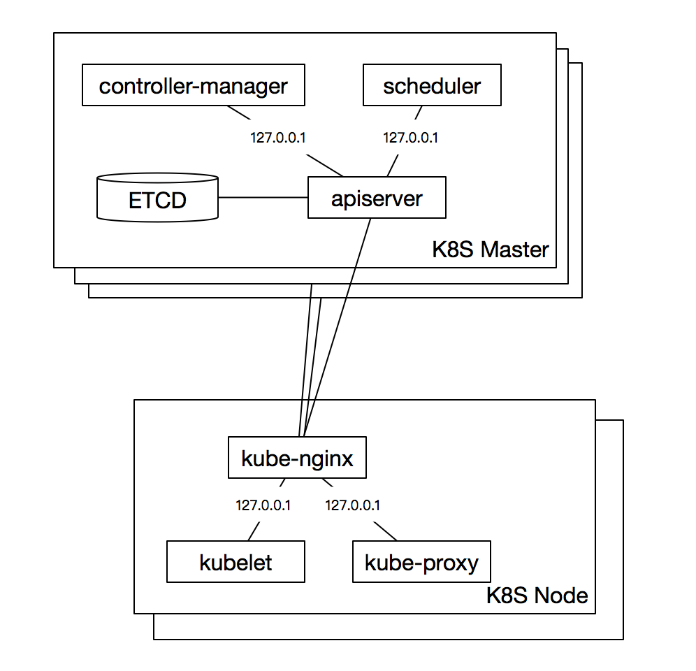

# 06-1 kube-apiserver 高可用之 nignx 代理

kublet、kube-proxy 的配置文件中静态指定了某个 kube-apiserver IP，如果该 apiserver 实例挂掉，可能会引起服务异常。

本文档讲解使用 nginx 4 层透明代理功能实现 K8S 节点访问 kube-apiserver 服务时高可用的方案。

## 基于 nginx proxy 的 kube-apiserver 高可用架构



+ 控制节点的 kube-controller-manager、kube-scheduler 是多实例部署，且都访问本地的 kube-apiserver，所以只要有一个控制节点工作正常，就可以保证高可用；
+ 集群内的 Pod 使用域名 kubernetes 访问 kube-apiserver 时也是高可用的：因为 kube-dns 会自动解析出多个 kube-apiserver 节点的 IP。
+ 工作节点上的 kubelet、kube-proxy 通过本地的 kube-nginx （监听 127.0.0.1）访问 kube-apiserver，从而实现 kube-apiserver 的高可用。
+ kube-nginx 会对所有 kube-apiserver 实例做健康检查和负载均衡；

## 下载和编译 nginx

下载源码：

``` bash
cd /opt/k8s/work
wget http://nginx.org/download/nginx-1.15.3.tar.gz
tar -xzvf nginx-1.15.3.tar.gz
```

配置编译参数：

``` bash
cd /opt/k8s/work/nginx-1.15.3
mkdir nginx-prefix
./configure --with-stream --without-http --prefix=$(pwd)/nginx-prefix --without-http_uwsgi_module --without-http_scgi_module --without-http_fastcgi_module
```
+ `--with-stream`：开启 4 层透明转发(TCP Proxy)功能；
+ `--without-xxx`：关闭所有其他功能，这样生成的动态链接二进制程序依赖最小；

输出：

``` bash
Configuration summary
  + PCRE library is not used
  + OpenSSL library is not used
  + zlib library is not used

  nginx path prefix: "/root/tmp/nginx-1.15.3/nginx-prefix"
  nginx binary file: "/root/tmp/nginx-1.15.3/nginx-prefix/sbin/nginx"
  nginx modules path: "/root/tmp/nginx-1.15.3/nginx-prefix/modules"
  nginx configuration prefix: "/root/tmp/nginx-1.15.3/nginx-prefix/conf"
  nginx configuration file: "/root/tmp/nginx-1.15.3/nginx-prefix/conf/nginx.conf"
  nginx pid file: "/root/tmp/nginx-1.15.3/nginx-prefix/logs/nginx.pid"
  nginx error log file: "/root/tmp/nginx-1.15.3/nginx-prefix/logs/error.log"
  nginx http access log file: "/root/tmp/nginx-1.15.3/nginx-prefix/logs/access.log"
  nginx http client request body temporary files: "client_body_temp"
  nginx http proxy temporary files: "proxy_temp"
```

编译和安装：

``` bash
cd /opt/k8s/work/nginx-1.15.3
make && make install
```

## 验证编译的 nginx 

``` bash
cd /opt/k8s/work/nginx-1.15.3
./nginx-prefix/sbin/nginx -v
```

输出：

``` bash
nginx version: nginx/1.15.3
```

查看 nginx 动态链接的库：

``` bash
$ ldd ./nginx-prefix/sbin/nginx
        linux-vdso.so.1 =>  (0x00007ffc945e7000)
        libdl.so.2 => /lib64/libdl.so.2 (0x00007f4385072000)
        libpthread.so.0 => /lib64/libpthread.so.0 (0x00007f4384e56000)
        libc.so.6 => /lib64/libc.so.6 (0x00007f4384a89000)
        /lib64/ld-linux-x86-64.so.2 (0x00007f4385276000)
```
+ 由于只开启了 4 层透明转发功能，所以除了依赖 libc 等操作系统核心 lib 库外，没有对其它 lib 的依赖(如 libz、libssl 等)，这样可以方便部署到各版本操作系统中；

## 安装和部署 nginx

创建目录结构：

``` bash
mkdir -p /opt/k8s/kube-nginx/{conf,logs,sbin}
```

拷贝二进制程序：

``` bash
cp /opt/k8s/work/nginx-1.15.3/nginx-prefix/sbin/nginx  /opt/k8s/kube-nginx/sbin/kube-nginx
chmod a+x /opt/k8s/kube-nginx/sbin/*
```
+ 进程重命名为 kube-nginx；

配置 nginx，开启 4 层透明转发功能：

``` bash
cat > /opt/k8s/kube-nginx/conf/kube-nginx.conf <<EOF
worker_processes 1;

events {
    worker_connections  1024;
}

stream {
    upstream backend {
        hash $remote_addr consistent;
        server 172.27.128.179:6443          max_fails=3 fail_timeout=30s;
        server 172.27.128.101:6443         max_fails=3 fail_timeout=30s;
        server 172.27.128.102:6443        max_fails=3 fail_timeout=30s;
    }

    server {
        listen 127.0.0.1:8443;
        proxy_connect_timeout 1s;
        proxy_pass backend;
    }
}
EOF
```
+ 需要根据集群 kube-apiserver 的实际情况，替换 backend 中 server 列表；

## 配置 systemd unit 文件，启动服务

配置 kube-nginx systemd unit 文件：

``` bash
cat > /etc/systemd/system/kube-nginx.service <<EOF
[Unit]
Description=kube-apiserver nginx proxy
After=network.target
After=network-online.target
Wants=network-online.target

[Service]
Type=forking
ExecStartPre=/opt/k8s/kube-nginx/sbin/kube-nginx -c /opt/k8s/kube-nginx/conf/kube-nginx.conf -p /opt/k8s/kube-nginx -t
ExecStart=/opt/k8s/kube-nginx/sbin/kube-nginx -c /opt/k8s/kube-nginx/conf/kube-nginx.conf -p /opt/k8s/kube-nginx
ExecReload=/opt/k8s/kube-nginx/sbin/kube-nginx -c /opt/k8s/kube-nginx/conf/kube-nginx.conf -p /opt/k8s/kube-nginx -s reload
PrivateTmp=true
Restart=always
RestartSec=5
StartLimitInterval=0
LimitNOFILE=65536

[Install]
WantedBy=multi-user.target
EOF
```

启动 kube-nginx 服务：

``` bash
systemctl daemon-reload && systemctl enable kube-nginx && systemctl restart kube-nginx
```

## 检查 kube-nginx 服务运行状态

``` bash
systemctl status kube-nginx |grep 'Active:'
```

确保状态为 `active (running)`，否则到 master 节点查看日志，确认原因：

``` bash
journalctl -u kube-nginx
```