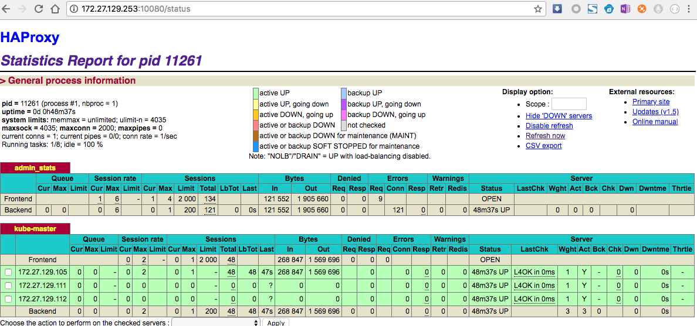

# 06-1.部署高可用组件

本文档讲解使用 keepalived 和 haproxy 实现 kube-apiserver 高可用的步骤：

+ keepalived 提供 kube-apiserver 对外服务的 VIP；
+ haproxy 监听 VIP，后端连接所有 kube-apiserver 实例，提供健康检查和负载均衡功能；

运行 keepalived 和 haproxy 的节点称为 LB 节点。由于 keepalived 是一主多备运行模式，故至少两个 LB 节点。

本文档复用 master 节点的三台机器，haproxy 监听的端口(8443) 需要与 kube-apiserver 的端口 6443 不同，避免冲突。

keepalived 在运行过程中周期检查本机的 haproxy 进程状态，如果检测到 haproxy 进程异常，则触发重新选主的过程，VIP 将飘移到新选出来的主节点，从而实现 VIP 的高可用。

所有组件（如 kubeclt、apiserver、controller-manager、scheduler 等）都通过 VIP 和 haproxy 监听的 8443 端口访问 kube-apiserver 服务。

## 安装软件包

``` bash
source /opt/k8s/bin/environment.sh
for node_ip in ${NODE_IPS[@]}
  do
    echo ">>> ${node_ip}"
    ssh root@${node_ip} "yum install -y keepalived haproxy"
  done
```

## 配置和下发 haproxy 配置文件

haproxy 配置文件：

``` bash
cd /opt/k8s/work
cat > haproxy.cfg <<EOF
global
    log /dev/log    local0
    log /dev/log    local1 notice
    chroot /var/lib/haproxy
    stats socket /var/run/haproxy-admin.sock mode 660 level admin
    stats timeout 30s
    user haproxy
    group haproxy
    daemon
    nbproc 1

defaults
    log     global
    timeout connect 5000
    timeout client  10m
    timeout server  10m

listen  admin_stats
    bind 0.0.0.0:10080
    mode http
    log 127.0.0.1 local0 err
    stats refresh 30s
    stats uri /status
    stats realm welcome login\ Haproxy
    stats auth admin:123456
    stats hide-version
    stats admin if TRUE

listen kube-master
    bind 0.0.0.0:8443
    mode tcp
    option tcplog
    balance source
    server 172.27.128.150 172.27.128.150:6443 check inter 2000 fall 2 rise 2 weight 1
    server 172.27.128.149 172.27.128.149:6443 check inter 2000 fall 2 rise 2 weight 1
    server 172.27.128.148 172.27.128.148:6443 check inter 2000 fall 2 rise 2 weight 1
EOF
```
+ haproxy 在 10080 端口输出 status 信息；
+ haproxy 监听**所有接口**的 8443 端口，该端口与环境变量 ${KUBE_APISERVER} 指定的端口必须一致；
+ server 字段列出所有 kube-apiserver 监听的 IP 和端口；

下发 haproxy.cfg 到所有 master 节点：

``` bash
cd /opt/k8s/work
source /opt/k8s/bin/environment.sh
for node_ip in ${NODE_IPS[@]}
  do
    echo ">>> ${node_ip}"
    scp haproxy.cfg root@${node_ip}:/etc/haproxy
  done
```

## 起 haproxy 服务

``` bash
source /opt/k8s/bin/environment.sh
for node_ip in ${NODE_IPS[@]}
  do
    echo ">>> ${node_ip}"
    ssh root@${node_ip} "systemctl restart haproxy"
  done
```

## 检查 haproxy 服务状态

``` bash
source /opt/k8s/bin/environment.sh
for node_ip in ${NODE_IPS[@]}
  do
    echo ">>> ${node_ip}"
    ssh root@${node_ip} "systemctl status haproxy|grep Active"
  done
```

确保状态为 `active (running)`，否则查看日志，确认原因：

``` bash
journalctl -u haproxy
```

检查 haproxy 是否监听 8443 端口：

``` bash
source /opt/k8s/bin/environment.sh
for node_ip in ${NODE_IPS[@]}
  do
    echo ">>> ${node_ip}"
    ssh root@${node_ip} "netstat -lnpt|grep haproxy"
  done
```

确保输出类似于:

``` bash
tcp        0      0 0.0.0.0:8443            0.0.0.0:*               LISTEN      120583/haproxy
```

## 配置和下发 keepalived 配置文件

keepalived 是一主（master）多备（backup）运行模式，故有两种类型的配置文件。master 配置文件只有一份，backup 配置文件视节点数目而定，对于本文档而言，规划如下：

+ master: 172.27.128.150
+ backup：172.27.128.149、172.27.128.148

master 配置文件：

``` bash
cd /opt/k8s/work
source /opt/k8s/bin/environment.sh
cat  > keepalived-master.conf <<EOF
global_defs {
    router_id lb-master-108
}

vrrp_script check-haproxy {
    script "killall -0 haproxy"
    interval 5
    weight -30
}

vrrp_instance VI-kube-master {
    state MASTER
    priority 120
    dont_track_primary
    interface ${VIP_IF}
    virtual_router_id 78
    advert_int 3
    track_script {
        check-haproxy
    }
    virtual_ipaddress {
        ${MASTER_VIP}
    }
}
EOF
```
+ VIP 所在的接口（interface ${VIP_IF}）为 `eth0`；
+ 使用 `killall -0 haproxy` 命令检查所在节点的 haproxy 进程是否正常。如果异常则将权重减少（-30）,从而触发重新选主过程；
+ router_id、virtual_router_id 用于标识属于该 HA 的 keepalived 实例，如果有多套 keepalived HA，则必须各不相同；

backup 配置文件：

``` bash
cd /opt/k8s/work
source /opt/k8s/bin/environment.sh
cat  > keepalived-backup.conf <<EOF
global_defs {
    router_id lb-backup-108
}

vrrp_script check-haproxy {
    script "killall -0 haproxy"
    interval 5
    weight -30
}

vrrp_instance VI-kube-master {
    state BACKUP
    priority 110
    dont_track_primary
    interface ${VIP_IF}
    virtual_router_id 78
    advert_int 3
    track_script {
        check-haproxy
    }
    virtual_ipaddress {
        ${MASTER_VIP}
    }
}
EOF
```
+ VIP 所在的接口（interface ${VIP_IF}）为 `eth0`；
+ 使用 `killall -0 haproxy` 命令检查所在节点的 haproxy 进程是否正常。如果异常则将权重减少（-30）,从而触发重新选主过程；
+ router_id、virtual_router_id 用于标识属于该 HA 的 keepalived 实例，如果有多套 keepalived HA，则必须各不相同；
+ priority 的值必须小于 master 的值；

## 下发 keepalived 配置文件

下发 master 配置文件：

``` bash
scp keepalived-master.conf root@172.27.128.150:/etc/keepalived/keepalived.conf
```

下发 backup 配置文件：

``` bash
scp keepalived-backup.conf root@172.27.128.149:/etc/keepalived/keepalived.conf
scp keepalived-backup.conf root@172.27.128.148:/etc/keepalived/keepalived.conf
```

## 起 keepalived 服务

``` bash
source /opt/k8s/bin/environment.sh
for node_ip in ${NODE_IPS[@]}
  do
    echo ">>> ${node_ip}"
    ssh root@${node_ip} "systemctl restart keepalived"
  done
```

## 检查 keepalived 服务

``` bash
source /opt/k8s/bin/environment.sh
for node_ip in ${NODE_IPS[@]}
  do
    echo ">>> ${node_ip}"
    ssh root@${node_ip} "systemctl status keepalived|grep Active"
  done
```

确保状态为 `active (running)`，否则查看日志，确认原因：

``` bash
journalctl -u keepalived
```

查看 VIP 所在的节点，确保可以 ping 通 VIP：

``` bash
source /opt/k8s/bin/environment.sh
for node_ip in ${NODE_IPS[@]}
  do
    echo ">>> ${node_ip}"
    ssh ${node_ip} "/usr/sbin/ip addr show ${VIP_IF}"
    ssh ${node_ip} "ping -c 1 ${MASTER_VIP}"
  done
```

## 查看 haproxy 状态页面

浏览器访问 ${MASTER_VIP}:10080/status 地址，查看 haproxy 状态页面：

