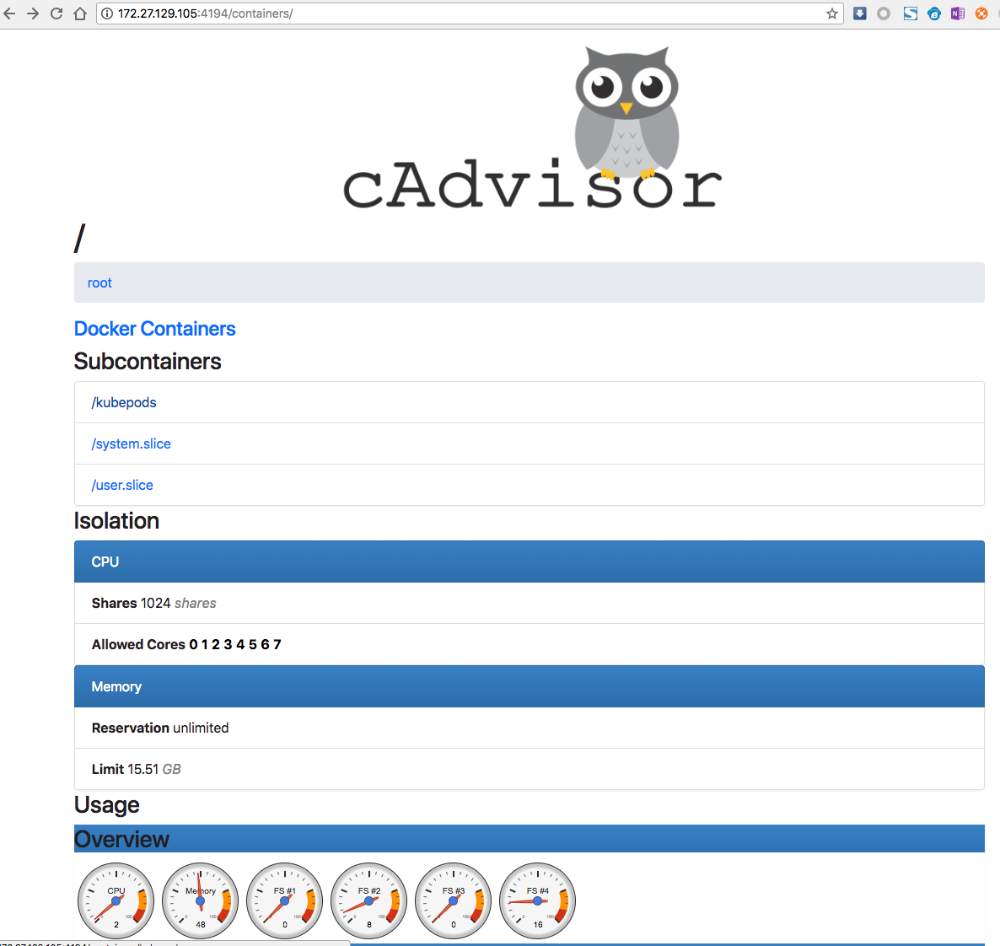
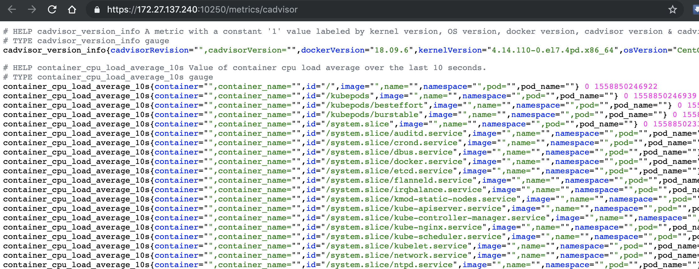

<!-- toc -->

tags: worker, kubelet

# 07-2.部署 kubelet 组件

kublet 运行在每个 worker 节点上，接收 kube-apiserver 发送的请求，管理 Pod 容器，执行交互式命令，如 exec、run、logs 等。

kublet 启动时自动向 kube-apiserver 注册节点信息，内置的 cadvisor 统计和监控节点的资源使用情况。

为确保安全，本文档只开启接收 https 请求的安全端口，对请求进行认证和授权，拒绝未授权的访问(如 apiserver、heapster)。

## 下载和分发 kubelet 二进制文件

参考 [06-0.部署master节点.md](06-0.部署master节点.md)

## 安装依赖包

参考 [07-0.部署worker节点.md](07-0.部署worker节点.md)

## 创建 kubelet bootstrapping kubeconfig 文件

``` bash
source /opt/k8s/bin/environment.sh
kubectl config set-cluster kubernetes \
  --certificate-authority=/etc/kubernetes/cert/ca.pem \
  --embed-certs=true \
  --server=${KUBE_APISERVER} \
  --kubeconfig=kubelet-bootstrap.kubeconfig
kubectl config set-credentials kubelet-bootstrap \
  --token=${BOOTSTRAP_TOKEN} \
  --kubeconfig=kubelet-bootstrap.kubeconfig
kubectl config set-context default \
  --cluster=kubernetes \
  --user=kubelet-bootstrap \
  --kubeconfig=kubelet-bootstrap.kubeconfig
kubectl config use-context default --kubeconfig=kubelet-bootstrap.kubeconfig
```

+ `--embed-certs` 为 `true` 时表示将 `certificate-authority` 证书写入到生成的 `bootstrap.kubeconfig` 文件中；
+ 设置 kubelet 客户端认证参数时**没有**指定秘钥和证书，后续由 `kube-apiserver` 自动生成；

## 分发 bootstrap kubeconfig 文件到所有 worker 节点

``` bash
source /opt/k8s/bin/environment.sh
for node_name in ${NODE_NAMES[@]}
  do
    echo ">>> ${node_ip}"
    scp kubelet-bootstrap.kubeconfig k8s@${node_name}:/etc/kubernetes/kubelet-bootstrap.kubeconfig
  done
```

## 创建和分发 kubelet systemd unit 文件

创建 kubelet systemd unit 文件模板：

``` bash
source /opt/k8s/bin/environment.sh
cat > kubelet.service.template <<EOF
[Unit]
Description=Kubernetes Kubelet
Documentation=https://github.com/GoogleCloudPlatform/kubernetes
After=docker.service
Requires=docker.service

[Service]
WorkingDirectory=/var/lib/kubelet
ExecStart=/opt/k8s/bin/kubelet \\
  --address=##NODE_IP## \\
  --hostname-override=##NODE_NAME## \\
  --pod-infra-container-image=registry.access.redhat.com/rhel7/pod-infrastructure:latest \\
  --bootstrap-kubeconfig=/etc/kubernetes/kubelet-bootstrap.kubeconfig \\
  --kubeconfig=/etc/kubernetes/kubelet.kubeconfig \\
  --feature-gates=RotateKubeletClientCertificate=true,RotateKubeletServerCertificate=true \\
  --rotate-certificates=true \\
  --cert-dir=/etc/kubernetes/cert \\
  --cluster-dns=${CLUSTER_DNS_SVC_IP} \\
  --cluster-domain=${CLUSTER_DNS_DOMAIN} \\
  --hairpin-mode=promiscuous-bridge \\
  --allow-privileged=true \\
  --serialize-image-pulls=false \\
  --cadvisor-port=0 \\
  --logtostderr=false \\
  --alsologtostderr=true \\
  --log-dir=/var/log/kubernetes \\
  --v=2
Restart=on-failure
RestartSec=5

[Install]
WantedBy=multi-user.target
EOF
```
+ `--address` 不能设置为 `127.0.0.1`，否则后续 Pods 访问 kubelet 的 API 接口时会失败，因为 Pods 访问的 `127.0.0.1` 指向自己而不是 kubelet；
+ 如果设置了 `--hostname-override` 选项，则 `kube-proxy` 也需要设置该选项，否则会出现找不到 Node 的情况；
+ `--bootstrap-kubeconfig` 指向 bootstrap kubeconfig 文件，kubelet 使用该文件中的用户名和 token 向 kube-apiserver 发送 TLS Bootstrapping 请求；
+ 管理员通过了 CSR 请求后，kubelet 自动在 `--cert-dir` 目录创建证书和私钥文件(`kubelet-client.crt` 和 `kubelet-client.key`)，然后写入 `--kubeconfig` 文件(自动创建 `--kubeconfig` 指定的文件)；
+ 建议在 `--kubeconfig` 配置文件中指定 `kube-apiserver` 地址;
+ `--cluster-dns` 指定 kubedns 的 Service IP(可以先分配，后续创建 kubedns 服务时指定该 IP)，`--cluster-domain` 指定域名后缀，这两个参数同时指定后才会生效；
+ `--cadvisor-port=0` 关闭 cAdvisor 的 Web 端口；

替换后的 unit 文件：[kubelet.service](https://github.com/opsnull/follow-me-install-kubernetes-cluster/blob/master/systemd/kubelet.service)

为各节点创建和分发 kubelet systemd unit 文件：

``` bash
source /opt/k8s/bin/environment.sh
for (( i=0; i < 3; i++ ))
  do
    echo ">>> {NODE_NAMES[i]}"
    sed -e "s/##NODE_NAME##/${NODE_NAMES[i]}/" -e "s/##NODE_IP##/${NODE_IPS[i]}/" kubelet.service.template > kubelet-${NODE_NAMES[i]}.service
    scp kubelet-${NODE_NAMES[i]}.service root@${NODE_NAMES[i]}:/etc/systemd/system/kubelet.service
  done
```

## 启动 kubelet 服务

kubelet 启动时向 kube-apiserver 发送 TLS bootstrapping 请求，需要先将 bootstrap token 文件中的 kubelet-bootstrap 用户赋予 system:node-bootstrapper 角色，然后 kubelet 才有权限创建认证请求(certificatesigningrequests)：

``` bash
kubectl create clusterrolebinding kubelet-bootstrap --clusterrole=system:node-bootstrapper --user=kubelet-bootstrap
```
+ `--user=kubelet-bootstrap` 是文件 `/etc/kubernetes/token.csv` 中指定的用户名，同时也写入了文件 `/etc/kubernetes/kubelet-bootstrap.kubeconfig`；

``` bash
source /opt/k8s/bin/environment.sh
for node_ip in ${NODE_IPS[@]}
  do
    echo ">>> ${node_ip}"
    ssh root@${node_ip} "mkdir -p /var/lib/kubelet" # 必须先创建工作目录
    ssh root@${node_ip} "swapoff -a" # 关闭 swap 分区
    ssh root@${node_ip} "systemctl daemon-reload && systemctl enable kubelet && systemctl restart kubelet"
  done
```
+ 如果开启了 swap 分区，kubelet 会启动失败，需要使用命令 `sudo swapoff -a` 关闭 swap 分区；

kubelet 启动后使用 --bootstrap-kubeconfig 向 kube-apiserver 发送 CSR 请求，当这个 CSR 被 approve 后，kube-controller-manager 为 kubelet 创建 TLS 客户端证书、私钥和 --kubeletconfig 文件。

注意：kube-controller-manager 需要配置 `--cluster-signing-cert-file` 和 `--cluster-signing-key-file` 参数，才会为 TLS Bootstrap 创建证书和私钥。

``` bash
$ kubectl get csr
NAME                                                   AGE       REQUESTOR                 CONDITION
node-csr-5B_XnF-wQOCOoq7tYAjvvYZZQfngtPj-rvEeFYWEp9o   1m        kubelet-bootstrap   Pending
node-csr-Nsj1I11Qj3a1fL7S5MtM1AnyHq3caZWq7d95HbFdb9s   1m        kubelet-bootstrap   Pending
node-csr-wROWYkKkJMC_uaTHiHYwkf9aKB6gfNC0K-p3Af03Q7s   1m        kubelet-bootstrap   Pending

$ kubectl get nodes
No resources found.
```
+ 三个 work 节点的 csr 均处于 pending 状态；

## approve kubelet CSR 请求

可以手动或自动 approve CSR 请求。推荐使用自动的方式，因为从 v1.8 版本开始，可以自动轮转 approve csr 后生成的证书。

### 手动 approve CSR 请求

查看 CSR 列表：

``` bash
$ kubectl get csr
NAME                                                   AGE       REQUESTOR                 CONDITION
node-csr-5B_XnF-wQOCOoq7tYAjvvYZZQfngtPj-rvEeFYWEp9o   1m        kubelet-bootstrap   Pending
node-csr-Nsj1I11Qj3a1fL7S5MtM1AnyHq3caZWq7d95HbFdb9s   1m        kubelet-bootstrap   Pending
node-csr-wROWYkKkJMC_uaTHiHYwkf9aKB6gfNC0K-p3Af03Q7s   1m        kubelet-bootstrap   Pending
```

approve CSR：

``` bash
$ kubectl certificate approve  node-csr-5B_XnF-wQOCOoq7tYAjvvYZZQfngtPj-rvEeFYWEp9o
certificatesigningrequest.certificates.k8s.io "node-csr-5B_XnF-wQOCOoq7tYAjvvYZZQfngtPj-rvEeFYWEp9o" approved
```

查看 Approve 结果：

``` bash
$ kubectl describe  csr node-csr-5B_XnF-wQOCOoq7tYAjvvYZZQfngtPj-rvEeFYWEp9o
Name:               node-csr-5B_XnF-wQOCOoq7tYAjvvYZZQfngtPj-rvEeFYWEp9o
Labels:             <none>
Annotations:        <none>
CreationTimestamp:  Tue, 03 Jul 2018 20:58:44 +0800
Requesting User:    kubelet-bootstrap
Status:             Approved,Issued
Subject:
         Common Name:    system:node:kube-node3
         Serial Number:
         Organization:   system:nodes
Events:  <none>
```
+ `Requesting User`：请求 CSR 的用户，kube-apiserver 对它进行认证和授权；
+ `Subject`：请求签名的证书信息；
+ 证书的 CN 是 system:node:kube-node3， Organization 是 system:nodes，kube-apiserver 的 Node 授权模式会授予该证书的相关权限；


kube-node3 已经 Ready：

``` bash
$ kubectl get nodes
NAME         STATUS    ROLES     AGE       VERSION
kube-node3   Ready     <none>    51s       v1.8.14
```

### 自动 approve CSR 请求

创建三个 ClusterRoleBinding，分别用于自动 approve client、renew client、renew server 证书：

``` bash
cat > csr-crb.yaml <<EOF
 # Approve all CSRs for the group "system:nodes"
 kind: ClusterRoleBinding
 apiVersion: rbac.authorization.k8s.io/v1
 metadata:
   name: auto-approve-csrs-for-group
 subjects:
 - kind: Group
   name: system:kubelet-bootstrap
   apiGroup: rbac.authorization.k8s.io
 roleRef:
   kind: ClusterRole
   name: system:certificates.k8s.io:certificatesigningrequests:nodeclient
   apiGroup: rbac.authorization.k8s.io
---
 # To let a node of the group "system:nodes" renew its own credentials
 kind: ClusterRoleBinding
 apiVersion: rbac.authorization.k8s.io/v1
 metadata:
   name: node-client-cert-renewal
 subjects:
 - kind: Group
   name: system:nodes
   apiGroup: rbac.authorization.k8s.io
 roleRef:
   kind: ClusterRole
   name: system:certificates.k8s.io:certificatesigningrequests:selfnodeclient
   apiGroup: rbac.authorization.k8s.io
---
# A ClusterRole which instructs the CSR approver to approve a node requesting a
# serving cert matching its client cert.
kind: ClusterRole
apiVersion: rbac.authorization.k8s.io/v1
metadata:
  name: approve-node-server-renewal-csr
rules:
- apiGroups: ["certificates.k8s.io"]
  resources: ["certificatesigningrequests/selfnodeserver"]
  verbs: ["create"]
---
 # To let a node of the group "system:nodes" renew its own server credentials
 kind: ClusterRoleBinding
 apiVersion: rbac.authorization.k8s.io/v1
 metadata:
   name: node-server-cert-renewal
 subjects:
 - kind: Group
   name: system:nodes
   apiGroup: rbac.authorization.k8s.io
 roleRef:
   kind: ClusterRole
   name: approve-node-server-renewal-csr
   apiGroup: rbac.authorization.k8s.io
EOF
```
+ `auto-approve-csrs-for-group` 的 Group 名称应该与 token 对应的 Group 名称(参考 kube-apiserver 的 token.csv 文件)一致；
+ `auto-approve-csrs-for-group`：自动 approve node 的第一次 CSR；
+ `node-client-cert-renewal`：自动 approve node 后续过期的 client 证书，自动生成的证书 Group 为 system:nodes;
+ `node-server-cert-renewal`：自动 approve node 后续过期的 server 证书，自动生成的证书 Group 为 system:nodes;

生效配置：

``` bash
$ kubectl apply -f csr-crb.yaml
```

## 查看 kublet 的情况

等待一段时间(1-10 分钟)，三个节点的 CSR 都被自动 approve：

``` bash
$ kubectl get csr
NAME                                                   AGE       REQUESTOR                 CONDITION
node-csr-5B_XnF-wQOCOoq7tYAjvvYZZQfngtPj-rvEeFYWEp9o   2h        kubelet-bootstrap   Approved,Issued
node-csr-Nsj1I11Qj3a1fL7S5MtM1AnyHq3caZWq7d95HbFdb9s   2h        kubelet-bootstrap   Approved,Issued
node-csr-fOQNwKCGTkQ7UVm3uoHmOHdEa2-2Y4XAse8pWtSxyCE   40s       kubelet-bootstrap   Approved,Issued
node-csr-wROWYkKkJMC_uaTHiHYwkf9aKB6gfNC0K-p3Af03Q7s   2h        kubelet-bootstrap   Approved,Issued
```

所有节点均 ready：

``` bash
$ kubectl get nodes
NAME         STATUS    ROLES     AGE       VERSION
kube-node1   Ready     <none>    19s       v1.8.14
kube-node2   Ready     <none>    39s       v1.8.14
kube-node3   Ready     <none>    32m       v1.8.14
```

kube-controller-manager 为各 node 生成了 kubeconfig 文件和公私钥：

``` bash
$ ls -l /etc/kubernetes/kubelet.kubeconfig
-rw------- 1 root root 2294 7月   3 21:34 /etc/kubernetes/kubelet.kubeconfig

$ ls -l /etc/kubernetes/cert/|grep kubelet
-rw-r--r-- 1 root root 1046 7月   3 21:34 kubelet-client.crt
-rw------- 1 root root  227 7月   3 20:56 kubelet-client.key
-rw-r--r-- 1 root root 1115 7月   3 20:53 kubelet.crt
-rw------- 1 root root 1675 7月   3 20:53 kubelet.key
```
+ kubelet-server 证书会周期轮转；

## kubelet 提供的 API 接口

kublet 启动后监听多个端口，用于接收 kube-apiserver 或其它组件发送的请求：

``` bash
$ sudo netstat -lnpt|grep kubelet
tcp        0      0 172.27.132.65:10250     0.0.0.0:*               LISTEN      19078/kubelet
tcp        0      0 172.27.132.65:10255     0.0.0.0:*               LISTEN      19078/kubelet
tcp        0      0 127.0.0.1:10248         0.0.0.0:*               LISTEN      19078/kubelet
```
+ 10248: healthz http 服务；
+ 10250: https API 服务；注意：未开启只读端口 10255；

例如执行 `kubectl exec -it nginx-ds-5rmws -- sh` 命令时，kube-apiserver 会向 kubelet 发送如下请求：

    POST /exec/default/nginx-ds-5rmws/my-nginx?command=sh&input=1&output=1&tty=1

kubelet 接收 10250 端口的 https 请求：

+ /pods、/runningpods
+ /metrics、/metrics/cadvisor、/metrics/probes
+ /spec
+ /stats、/stats/container
+ /logs
+ /run/、"/exec/", "/attach/", "/portForward/", "/containerLogs/" 等管理；

详情参考：https://github.com/kubernetes/kubernetes/blob/master/pkg/kubelet/server/server.go#L434:3

由于关闭了匿名认证，同时开启了 webhook 授权，所有访问 10250 端口 https API 的请求都需要被认证和授权。

预定义的 ClusterRole system:kubelet-api-admin 授予访问 kubelet 所有 API 的权限：

``` bash
$ kubectl describe clusterrole system:kubelet-api-admin
Name:         system:kubelet-api-admin
Labels:       kubernetes.io/bootstrapping=rbac-defaults
Annotations:  rbac.authorization.kubernetes.io/autoupdate=true
PolicyRule:
  Resources      Non-Resource URLs  Resource Names  Verbs
  ---------      -----------------  --------------  -----
  nodes          []                 []              [get list watch proxy]
  nodes/log      []                 []              [*]
  nodes/metrics  []                 []              [*]
  nodes/proxy    []                 []              [*]
  nodes/spec     []                 []              [*]
  nodes/stats    []                 []              [*]
```

## kublet api 认证和授权

kublet 配置了如下认证参数：

+ authentication.anonymous.enabled：设置为 false，不允许匿名访问 10250 端口；
+ authentication.x509.clientCAFile：指定签名客户端证书的 CA 证书，开启 HTTPs 证书认证；
+ authentication.webhook.enabled=true：开启 HTTPs bearer token 认证；

同时配置了如下授权参数：

+ authroization.mode=Webhook：开启 RBAC 授权；

kubelet 收到请求后，使用 clientCAFile 对证书签名进行认证，或者查询 bearer token 是否有效。如果两者都没通过，则拒绝请求，提示 Unauthorized：

``` bash
curl -s --cacert /etc/kubernetes/cert/ca.pem https://172.27.129.111:10250/metrics
Unauthorized

curl -s --cacert /etc/kubernetes/cert/ca.pem -H "Authorization: Bearer 123456" https://172.27.129.111:10250/metrics
Unauthorized
```

通过认证后，kubelet 使用 SubjectAccessReview API 向 kube-apiserver 发送请求，查询证书或 token 对应的 user、group 是否有操作资源的权限(RBAC)；

证书认证和授权：

``` bash
# 权限不足的证书；
curl -s --cacert /etc/kubernetes/cert/ca.pem --cert /etc/kubernetes/cert/kube-controller-manager.pem --key /etc/kubernetes/cert/kube-controller-manager-key.pem https://172.27.129.111:10250/metrics
Forbidden (user=system:kube-controller-manager, verb=get, resource=nodes, subresource=metrics)

# 使用部署 kubectl 命令行工具时创建的、具有最高权限的 admin 证书；
curl -s --cacert /etc/kubernetes/cert/ca.pem --cert admin.pem --key admin-key.pem https://172.27.129.111:10250/metrics|head
# HELP apiserver_client_certificate_expiration_seconds Distribution of the remaining lifetime on the certificate used to authenticate a request.
# TYPE apiserver_client_certificate_expiration_seconds histogram
apiserver_client_certificate_expiration_seconds_bucket{le="0"} 0
apiserver_client_certificate_expiration_seconds_bucket{le="21600"} 0
apiserver_client_certificate_expiration_seconds_bucket{le="43200"} 0
apiserver_client_certificate_expiration_seconds_bucket{le="86400"} 0
apiserver_client_certificate_expiration_seconds_bucket{le="172800"} 0
apiserver_client_certificate_expiration_seconds_bucket{le="345600"} 0
apiserver_client_certificate_expiration_seconds_bucket{le="604800"} 0
apiserver_client_certificate_expiration_seconds_bucket{le="2.592e+06"} 0
```

bear token 认证和授权：

创建一个 ServiceAccount，将它和 ClusterRole system:kubelet-api-admin 绑定，从而具有调用 kubelet API 的权限：

``` bash
kubectl create sa kubelet-api-test
kubectl create clusterrolebinding kubelet-api-test --clusterrole=system:kubelet-api-admin --serviceaccount=default:kubelet-api-test
SECRET=$(kubectl get secrets | grep kubelet-api-test | awk '{print $1}')
TOKEN=$(kubectl describe secret ${SECRET} | grep -E '^token' | awk '{print $2}')
echo ${TOKEN}

curl -s --cacert /etc/kubernetes/cert/ca.pem -H "Authorization: Bearer ${TOKEN}" https://172.27.129.111:10250/metrics|head
# HELP apiserver_client_certificate_expiration_seconds Distribution of the remaining lifetime on the certificate used to authenticate a request.
# TYPE apiserver_client_certificate_expiration_seconds histogram
apiserver_client_certificate_expiration_seconds_bucket{le="0"} 0
apiserver_client_certificate_expiration_seconds_bucket{le="21600"} 0
apiserver_client_certificate_expiration_seconds_bucket{le="43200"} 0
apiserver_client_certificate_expiration_seconds_bucket{le="86400"} 0
apiserver_client_certificate_expiration_seconds_bucket{le="172800"} 0
apiserver_client_certificate_expiration_seconds_bucket{le="345600"} 0
apiserver_client_certificate_expiration_seconds_bucket{le="604800"} 0
apiserver_client_certificate_expiration_seconds_bucket{le="2.592e+06"} 0
```

### cadvisor 和 metrics

cadvisor 统计所在节点各容器的资源(CPU、内存、磁盘、网卡)使用情况，分别在自己的 http web 页面(4194 端口)和 10250 以 promehteus metrics 的形式输出。

浏览器访问 http://172.27.129.105:4194/containers/ 可以查看到 cadvisor 的监控页面：



浏览器访问 https://172.27.129.80:10250/metrics 和 https://172.27.129.80:10250/metrics/cadvisor 分别返回 kublet 和 cadvisor 的 metrics。



注意：

+ kublet.config.json 设置 authentication.anonymous.enabled 为 false，不允许匿名证书访问 10250 的 https 服务；
+ 参考[A.浏览器访问kube-apiserver安全端口.md](A.浏览器访问kube-apiserver安全端口.md)，创建和导入相关证书，然后访问上面的 10250 端口；