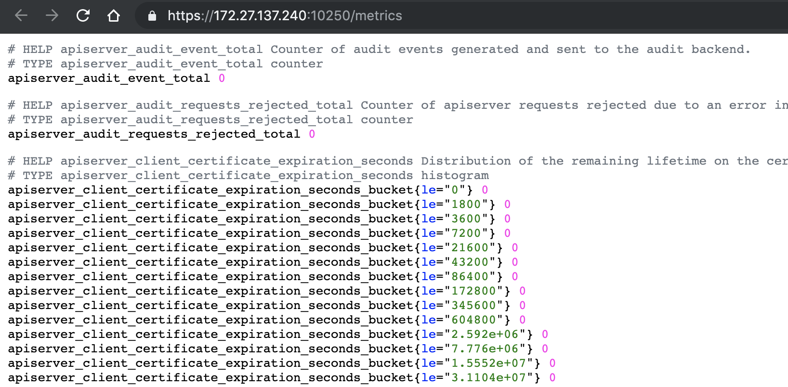

tags: worker, kubelet

# 07-2.部署 kubelet 组件

<!-- TOC -->

- [07-2.部署 kubelet 组件](#07-2部署-kubelet-组件)
    - [下载和分发 kubelet 二进制文件](#下载和分发-kubelet-二进制文件)
    - [安装依赖包](#安装依赖包)
    - [创建 kubelet bootstrap kubeconfig 文件](#创建-kubelet-bootstrap-kubeconfig-文件)
    - [分发 bootstrap kubeconfig 文件到所有 worker 节点](#分发-bootstrap-kubeconfig-文件到所有-worker-节点)
    - [创建和分发 kubelet 参数配置文件](#创建和分发-kubelet-参数配置文件)
    - [创建和分发 kubelet systemd unit 文件](#创建和分发-kubelet-systemd-unit-文件)
    - [Bootstrap Token Auth 和授予权限](#bootstrap-token-auth-和授予权限)
    - [启动 kubelet 服务](#启动-kubelet-服务)
    - [自动 approve CSR 请求](#自动-approve-csr-请求)
    - [查看 kubelet 的情况](#查看-kubelet-的情况)
    - [手动 approve server cert csr](#手动-approve-server-cert-csr)
    - [kubelet 提供的 API 接口](#kubelet-提供的-api-接口)
    - [kubelet api 认证和授权](#kubelet-api-认证和授权)
        - [证书认证和授权](#证书认证和授权)
        - [bear token 认证和授权](#bear-token-认证和授权)
        - [cadvisor 和 metrics](#cadvisor-和-metrics)
    - [获取 kubelet 的配置](#获取-kubelet-的配置)
    - [参考](#参考)

<!-- /TOC -->

kubelet 运行在每个 worker 节点上，接收 kube-apiserver 发送的请求，管理 Pod 容器，执行交互式命令，如 exec、run、logs 等。

kubelet 启动时自动向 kube-apiserver 注册节点信息，内置的 cadvisor 统计和监控节点的资源使用情况。

为确保安全，部署时关闭了 kubelet 的非安全 http 端口，对请求进行认证和授权，拒绝未授权的访问(如 apiserver、heapster 的请求)。

注意：如果没有特殊指明，本文档的所有操作**均在 zhangjun-k8s01 节点上执行**，然后远程分发文件和执行命令。

## 下载和分发 kubelet 二进制文件

参考 [06-1.部署master节点.md](06-1.部署master节点.md)。

## 安装依赖包

参考 [07-0.部署worker节点.md](07-0.部署worker节点.md)。

## 创建 kubelet bootstrap kubeconfig 文件

``` bash
cd /opt/k8s/work
source /opt/k8s/bin/environment.sh
for node_name in ${NODE_NAMES[@]}
  do
    echo ">>> ${node_name}"

    # 创建 token
    export BOOTSTRAP_TOKEN=$(kubeadm token create \
      --description kubelet-bootstrap-token \
      --groups system:bootstrappers:${node_name} \
      --kubeconfig ~/.kube/config)

    # 设置集群参数
    kubectl config set-cluster kubernetes \
      --certificate-authority=/etc/kubernetes/cert/ca.pem \
      --embed-certs=true \
      --server=${KUBE_APISERVER} \
      --kubeconfig=kubelet-bootstrap-${node_name}.kubeconfig

    # 设置客户端认证参数
    kubectl config set-credentials kubelet-bootstrap \
      --token=${BOOTSTRAP_TOKEN} \
      --kubeconfig=kubelet-bootstrap-${node_name}.kubeconfig

    # 设置上下文参数
    kubectl config set-context default \
      --cluster=kubernetes \
      --user=kubelet-bootstrap \
      --kubeconfig=kubelet-bootstrap-${node_name}.kubeconfig

    # 设置默认上下文
    kubectl config use-context default --kubeconfig=kubelet-bootstrap-${node_name}.kubeconfig
  done
```
+ 向 kubeconfig 写入的是 token，bootstrap 结束后 kube-controller-manager 为 kubelet 创建 client 和 server 证书；

查看 kubeadm 为各节点创建的 token：

``` bash
$ kubeadm token list --kubeconfig ~/.kube/config
TOKEN                     TTL       EXPIRES                     USAGES                   DESCRIPTION               EXTRA GROUPS
3gzd53.ahl5unc2d09yjid9   23h       2019-05-27T11:29:57+08:00   authentication,signing   kubelet-bootstrap-token   system:bootstrappers:zhangjun-k8s02
82jfrm.um1mkjkr7w2c7ex9   23h       2019-05-27T11:29:56+08:00   authentication,signing   kubelet-bootstrap-token   system:bootstrappers:zhangjun-k8s01
b1f7np.lwnnzur3i8ymtkur   23h       2019-05-27T11:29:57+08:00   authentication,signing   kubelet-bootstrap-token   system:bootstrappers:zhangjun-k8s03
```
+ token 有效期为 1 天，**超期后将不能**再被用来 boostrap kubelet，且会被 kube-controller-manager 的 tokencleaner 清理；
+ kube-apiserver 接收 kubelet 的 bootstrap token 后，将请求的 user 设置为 `system:bootstrap:<Token ID>`，group 设置为 `system:bootstrappers`，后续将为这个 group 设置 ClusterRoleBinding；

查看各 token 关联的 Secret：

``` bash
$ kubectl get secrets  -n kube-system|grep bootstrap-token
bootstrap-token-3gzd53                           bootstrap.kubernetes.io/token         7      33s
bootstrap-token-82jfrm                           bootstrap.kubernetes.io/token         7      34s
bootstrap-token-b1f7np                           bootstrap.kubernetes.io/token         7      33s
```

## 分发 bootstrap kubeconfig 文件到所有 worker 节点

``` bash
cd /opt/k8s/work
source /opt/k8s/bin/environment.sh
for node_name in ${NODE_NAMES[@]}
  do
    echo ">>> ${node_name}"
    scp kubelet-bootstrap-${node_name}.kubeconfig root@${node_name}:/etc/kubernetes/kubelet-bootstrap.kubeconfig
  done
```

## 创建和分发 kubelet 参数配置文件

从 v1.10 开始，部分 kubelet 参数需在**配置文件**中配置，`kubelet --help` 会提示：

    DEPRECATED: This parameter should be set via the config file specified by the Kubelet's --config flag

创建 kubelet 参数配置文件模板（可配置项参考[代码中注释](https://github.com/kubernetes/kubernetes/blob/master/pkg/kubelet/apis/config/types.go)
）：

``` bash
cd /opt/k8s/work
source /opt/k8s/bin/environment.sh
cat <<EOF | tee kubelet-config.yaml.template
kind: KubeletConfiguration
apiVersion: kubelet.config.k8s.io/v1beta1
address: "##NODE_IP##"
staticPodPath: ""
syncFrequency: 1m
fileCheckFrequency: 20s
httpCheckFrequency: 20s
staticPodURL: ""
port: 10250
readOnlyPort: 0
rotateCertificates: true
serverTLSBootstrap: true
authentication:
  anonymous:
    enabled: false
  webhook:
    enabled: true
  x509:
    clientCAFile: "/etc/kubernetes/cert/ca.pem"
authorization:
  mode: Webhook
registryPullQPS: 0
registryBurst: 20
eventRecordQPS: 0
eventBurst: 20
enableDebuggingHandlers: true
enableContentionProfiling: true
healthzPort: 10248
healthzBindAddress: "##NODE_IP##"
clusterDomain: "${CLUSTER_DNS_DOMAIN}"
clusterDNS:
  - "${CLUSTER_DNS_SVC_IP}"
nodeStatusUpdateFrequency: 10s
nodeStatusReportFrequency: 1m
imageMinimumGCAge: 2m
imageGCHighThresholdPercent: 85
imageGCLowThresholdPercent: 80
volumeStatsAggPeriod: 1m
kubeletCgroups: ""
systemCgroups: ""
cgroupRoot: ""
cgroupsPerQOS: true
cgroupDriver: cgroupfs
runtimeRequestTimeout: 10m
hairpinMode: promiscuous-bridge
maxPods: 220
podCIDR: "${CLUSTER_CIDR}"
podPidsLimit: -1
resolvConf: /etc/resolv.conf
maxOpenFiles: 1000000
kubeAPIQPS: 1000
kubeAPIBurst: 2000
serializeImagePulls: false
evictionHard:
  memory.available:  "100Mi"
  nodefs.available:  "10%"
  nodefs.inodesFree: "5%"
  imagefs.available: "15%"
evictionSoft: nil
enableControllerAttachDetach: true
failSwapOn: true
containerLogMaxSize: 20Mi
containerLogMaxFiles: 10
systemReserved: nil
kubeReserved: nil
systemReservedCgroup: ""
kubeReservedCgroup: ""
enforceNodeAllocatable: ["pods"]
EOF
```
+ address：kubelet 安全端口（https，10250）监听的地址，不能为 127.0.0.1，否则 kube-apiserver、heapster 等不能调用 kubelet 的 API；
+ readOnlyPort=0：关闭只读端口(默认 10255)，等效为未指定；
+ authentication.anonymous.enabled：设置为 false，不允许匿名访问 10250 端口；
+ authentication.x509.clientCAFile：指定签名客户端证书的 CA 证书，开启 HTTP 证书认证；
+ authentication.webhook.enabled=true：开启 HTTPs bearer token 认证；
+ 对于未通过 x509 证书和 webhook 认证的请求(kube-apiserver 或其他客户端)，将被拒绝，提示 Unauthorized；
+ authroization.mode=Webhook：kubelet 使用 SubjectAccessReview API 查询 kube-apiserver 某 user、group 是否具有操作资源的权限(RBAC)；
+ featureGates.RotateKubeletClientCertificate、featureGates.RotateKubeletServerCertificate：自动 rotate 证书，证书的有效期取决于 kube-controller-manager 的 --experimental-cluster-signing-duration 参数；
+ 需要 root 账户运行；

为各节点创建和分发 kubelet 配置文件：

``` bash
cd /opt/k8s/work
source /opt/k8s/bin/environment.sh
for node_ip in ${NODE_IPS[@]}
  do 
    echo ">>> ${node_ip}"
    sed -e "s/##NODE_IP##/${node_ip}/" kubelet-config.yaml.template > kubelet-config-${node_ip}.yaml.template
    scp kubelet-config-${node_ip}.yaml.template root@${node_ip}:/etc/kubernetes/kubelet-config.yaml
  done
```

## 创建和分发 kubelet systemd unit 文件

创建 kubelet systemd unit 文件模板：

``` bash
cd /opt/k8s/work
source /opt/k8s/bin/environment.sh
cat > kubelet.service.template <<EOF
[Unit]
Description=Kubernetes Kubelet
Documentation=https://github.com/GoogleCloudPlatform/kubernetes
After=docker.service
Requires=docker.service

[Service]
WorkingDirectory=${K8S_DIR}/kubelet
ExecStart=/opt/k8s/bin/kubelet \\
  --allow-privileged=true \\
  --bootstrap-kubeconfig=/etc/kubernetes/kubelet-bootstrap.kubeconfig \\
  --cert-dir=/etc/kubernetes/cert \\
  --cni-conf-dir=/etc/cni/net.d \\
  --container-runtime=docker \\
  --container-runtime-endpoint=unix:///var/run/dockershim.sock \\
  --root-dir=${K8S_DIR}/kubelet \\
  --kubeconfig=/etc/kubernetes/kubelet.kubeconfig \\
  --config=/etc/kubernetes/kubelet-config.yaml \\
  --hostname-override=##NODE_NAME## \\
  --pod-infra-container-image=registry.cn-beijing.aliyuncs.com/k8s_images/pause-amd64:3.1 \\
  --image-pull-progress-deadline=15m \\
  --volume-plugin-dir=${K8S_DIR}/kubelet/kubelet-plugins/volume/exec/ \\
  --logtostderr=true \\
  --v=2
Restart=always
RestartSec=5
StartLimitInterval=0

[Install]
WantedBy=multi-user.target
EOF
```
+ 如果设置了 `--hostname-override` 选项，则 `kube-proxy` 也需要设置该选项，否则会出现找不到 Node 的情况；
+ `--bootstrap-kubeconfig`：指向 bootstrap kubeconfig 文件，kubelet 使用该文件中的用户名和 token 向 kube-apiserver 发送 TLS Bootstrapping 请求；
+ K8S approve kubelet 的 csr 请求后，在 `--cert-dir` 目录创建证书和私钥文件，然后写入 `--kubeconfig` 文件；
+ `--pod-infra-container-image` 不使用 redhat 的 `pod-infrastructure:latest` 镜像，它不能回收容器的僵尸；

为各节点创建和分发 kubelet systemd unit 文件：

``` bash
cd /opt/k8s/work
source /opt/k8s/bin/environment.sh
for node_name in ${NODE_NAMES[@]}
  do 
    echo ">>> ${node_name}"
    sed -e "s/##NODE_NAME##/${node_name}/" kubelet.service.template > kubelet-${node_name}.service
    scp kubelet-${node_name}.service root@${node_name}:/etc/systemd/system/kubelet.service
  done
```

## Bootstrap Token Auth 和授予权限

kubelet 启动时查找 `--kubeletconfig` 参数对应的文件是否存在，如果不存在则使用 `--bootstrap-kubeconfig` 指定的 kubeconfig 文件向 kube-apiserver 发送证书签名请求 (CSR)。

kube-apiserver 收到 CSR 请求后，对其中的 Token 进行认证，认证通过后将请求的 user 设置为 `system:bootstrap:<Token ID>`，group 设置为 `system:bootstrappers`，这一过程称为 Bootstrap Token Auth。

默认情况下，这个 user 和 group 没有创建 CSR 的权限，kubelet 启动失败，错误日志如下：

``` bash
$ sudo journalctl -u kubelet -a |grep -A 2 'certificatesigningrequests'
May 26 12:13:41 zhangjun-k8s01 kubelet[128468]: I0526 12:13:41.798230  128468 certificate_manager.go:366] Rotating certificates
May 26 12:13:41 zhangjun-k8s01 kubelet[128468]: E0526 12:13:41.801997  128468 certificate_manager.go:385] Failed while requesting a signed certificate from the master: cannot cre
ate certificate signing request: certificatesigningrequests.certificates.k8s.io is forbidden: User "system:bootstrap:82jfrm" cannot create resource "certificatesigningrequests" i
n API group "certificates.k8s.io" at the cluster scope
May 26 12:13:42 zhangjun-k8s01 kubelet[128468]: E0526 12:13:42.044828  128468 kubelet.go:2244] node "zhangjun-k8s01" not found
May 26 12:13:42 zhangjun-k8s01 kubelet[128468]: E0526 12:13:42.078658  128468 reflector.go:126] k8s.io/kubernetes/pkg/kubelet/kubelet.go:442: Failed to list *v1.Service: Unauthor
ized
May 26 12:13:42 zhangjun-k8s01 kubelet[128468]: E0526 12:13:42.079873  128468 reflector.go:126] k8s.io/kubernetes/pkg/kubelet/kubelet.go:451: Failed to list *v1.Node: Unauthorize
d
May 26 12:13:42 zhangjun-k8s01 kubelet[128468]: E0526 12:13:42.082683  128468 reflector.go:126] k8s.io/client-go/informers/factory.go:133: Failed to list *v1beta1.CSIDriver: Unau
thorized
May 26 12:13:42 zhangjun-k8s01 kubelet[128468]: E0526 12:13:42.084473  128468 reflector.go:126] k8s.io/kubernetes/pkg/kubelet/config/apiserver.go:47: Failed to list *v1.Pod: Unau
thorized
May 26 12:13:42 zhangjun-k8s01 kubelet[128468]: E0526 12:13:42.088466  128468 reflector.go:126] k8s.io/client-go/informers/factory.go:133: Failed to list *v1beta1.RuntimeClass: U
nauthorized
```

解决办法是：创建一个 clusterrolebinding，将 group system:bootstrappers 和 clusterrole system:node-bootstrapper 绑定：

``` bash
$ kubectl create clusterrolebinding kubelet-bootstrap --clusterrole=system:node-bootstrapper --group=system:bootstrappers
```

## 启动 kubelet 服务

``` bash
source /opt/k8s/bin/environment.sh
for node_ip in ${NODE_IPS[@]}
  do
    echo ">>> ${node_ip}"
    ssh root@${node_ip} "mkdir -p ${K8S_DIR}/kubelet/kubelet-plugins/volume/exec/"
    ssh root@${node_ip} "/usr/sbin/swapoff -a"
    ssh root@${node_ip} "systemctl daemon-reload && systemctl enable kubelet && systemctl restart kubelet"
  done
```
+ 启动服务前必须先创建工作目录；
+ 关闭 swap 分区，否则 kubelet 会启动失败；

```bash
$ journalctl -u kubelet |tail
8月 15 12:16:49 zhangjun-k8s01 kubelet[7807]: I0815 12:16:49.578598    7807 feature_gate.go:230] feature gates: &{map[RotateKubeletClientCertificate:true RotateKubeletServerCertificate:true]}
8月 15 12:16:49 zhangjun-k8s01 kubelet[7807]: I0815 12:16:49.578698    7807 feature_gate.go:230] feature gates: &{map[RotateKubeletClientCertificate:true RotateKubeletServerCertificate:true]}
8月 15 12:16:50 zhangjun-k8s01 kubelet[7807]: I0815 12:16:50.205871    7807 mount_linux.go:214] Detected OS with systemd
8月 15 12:16:50 zhangjun-k8s01 kubelet[7807]: I0815 12:16:50.205939    7807 server.go:408] Version: v1.11.2
8月 15 12:16:50 zhangjun-k8s01 kubelet[7807]: I0815 12:16:50.206013    7807 feature_gate.go:230] feature gates: &{map[RotateKubeletClientCertificate:true RotateKubeletServerCertificate:true]}
8月 15 12:16:50 zhangjun-k8s01 kubelet[7807]: I0815 12:16:50.206101    7807 feature_gate.go:230] feature gates: &{map[RotateKubeletServerCertificate:true RotateKubeletClientCertificate:true]}
8月 15 12:16:50 zhangjun-k8s01 kubelet[7807]: I0815 12:16:50.206217    7807 plugins.go:97] No cloud provider specified.
8月 15 12:16:50 zhangjun-k8s01 kubelet[7807]: I0815 12:16:50.206237    7807 server.go:524] No cloud provider specified: "" from the config file: ""
8月 15 12:16:50 zhangjun-k8s01 kubelet[7807]: I0815 12:16:50.206264    7807 bootstrap.go:56] Using bootstrap kubeconfig to generate TLS client cert, key and kubeconfig file
8月 15 12:16:50 zhangjun-k8s01 kubelet[7807]: I0815 12:16:50.208628    7807 bootstrap.go:86] No valid private key and/or certificate found, reusing existing private key or creating a new one
```

kubelet 启动后使用 --bootstrap-kubeconfig 向 kube-apiserver 发送 CSR 请求，当这个 CSR 被 approve 后，kube-controller-manager 为 kubelet 创建 TLS 客户端证书、私钥和 --kubeletconfig 文件。

注意：kube-controller-manager 需要配置 `--cluster-signing-cert-file` 和 `--cluster-signing-key-file` 参数，才会为 TLS Bootstrap 创建证书和私钥。

``` bash
$ kubectl get csr
NAME                                                   AGE       REQUESTOR                 CONDITION
csr-5f4vh   31s   system:bootstrap:82jfrm   Pending
csr-5rw7s   29s   system:bootstrap:b1f7np   Pending
csr-m29fm   31s   system:bootstrap:3gzd53   Pending

$ kubectl get nodes
No resources found.
```
+ 三个 worker 节点的 csr 均处于 pending 状态；

## 自动 approve CSR 请求

创建三个 ClusterRoleBinding，分别用于自动 approve client、renew client、renew server 证书：

``` bash
cd /opt/k8s/work
cat > csr-crb.yaml <<EOF
 # Approve all CSRs for the group "system:bootstrappers"
 kind: ClusterRoleBinding
 apiVersion: rbac.authorization.k8s.io/v1
 metadata:
   name: auto-approve-csrs-for-group
 subjects:
 - kind: Group
   name: system:bootstrappers
   apiGroup: rbac.authorization.k8s.io
 roleRef:
   kind: ClusterRole
   name: system:certificates.k8s.io:certificatesigningrequests:nodeclient
   apiGroup: rbac.authorization.k8s.io
---
 # To let a node of the group "system:nodes" renew its own credentials
 kind: ClusterRoleBinding
 apiVersion: rbac.authorization.k8s.io/v1
 metadata:
   name: node-client-cert-renewal
 subjects:
 - kind: Group
   name: system:nodes
   apiGroup: rbac.authorization.k8s.io
 roleRef:
   kind: ClusterRole
   name: system:certificates.k8s.io:certificatesigningrequests:selfnodeclient
   apiGroup: rbac.authorization.k8s.io
---
# A ClusterRole which instructs the CSR approver to approve a node requesting a
# serving cert matching its client cert.
kind: ClusterRole
apiVersion: rbac.authorization.k8s.io/v1
metadata:
  name: approve-node-server-renewal-csr
rules:
- apiGroups: ["certificates.k8s.io"]
  resources: ["certificatesigningrequests/selfnodeserver"]
  verbs: ["create"]
---
 # To let a node of the group "system:nodes" renew its own server credentials
 kind: ClusterRoleBinding
 apiVersion: rbac.authorization.k8s.io/v1
 metadata:
   name: node-server-cert-renewal
 subjects:
 - kind: Group
   name: system:nodes
   apiGroup: rbac.authorization.k8s.io
 roleRef:
   kind: ClusterRole
   name: approve-node-server-renewal-csr
   apiGroup: rbac.authorization.k8s.io
EOF
kubectl apply -f csr-crb.yaml
```
+ auto-approve-csrs-for-group：自动 approve node 的第一次 CSR； 注意第一次 CSR 时，请求的 Group 为 system:bootstrappers；
+ node-client-cert-renewal：自动 approve node 后续过期的 client 证书，自动生成的证书 Group 为 system:nodes;
+ node-server-cert-renewal：自动 approve node 后续过期的 server 证书，自动生成的证书 Group 为 system:nodes;


## 查看 kubelet 的情况

等待一段时间(1-10 分钟)，三个节点的 CSR 都被自动 approved：

``` bash
$ kubectl get csr
NAME                                                   AGE       REQUESTOR                 CONDITION
csr-5f4vh   7m59s   system:bootstrap:82jfrm      Approved,Issued
csr-5r7j7   4m45s   system:node:zhangjun-k8s03   Pending
csr-5rw7s   7m57s   system:bootstrap:b1f7np      Approved,Issued
csr-9snww   6m37s   system:bootstrap:82jfrm      Approved,Issued
csr-c7z56   4m46s   system:node:zhangjun-k8s02   Pending
csr-j55lh   4m46s   system:node:zhangjun-k8s01   Pending
csr-m29fm   7m59s   system:bootstrap:3gzd53      Approved,Issued
csr-rc8w7   6m37s   system:bootstrap:3gzd53      Approved,Issued
csr-vd52r   6m36s   system:bootstrap:b1f7np      Approved,Issued
```
+ Pending 的 CSR 用于创建 kubelet server 证书，需要手动 approve，参考后文。

所有节点均 ready：

``` bash
$ kubectl get nodes
NAME             STATUS   ROLES    AGE    VERSION
zhangjun-k8s01   Ready    <none>   5m5s   v1.14.2
zhangjun-k8s02   Ready    <none>   5m5s   v1.14.2
zhangjun-k8s03   Ready    <none>   5m4s   v1.14.2
```

kube-controller-manager 为各 node 生成了 kubeconfig 文件和公私钥：

``` bash
$ ls -l /etc/kubernetes/kubelet.kubeconfig
-rw------- 1 root root 2306 May 26 12:17 /etc/kubernetes/kubelet.kubeconfig

$ ls -l /etc/kubernetes/cert/|grep kubelet
-rw------- 1 root root 1281 May 26 12:19 kubelet-client-2019-05-26-12-19-25.pem
lrwxrwxrwx 1 root root   59 May 26 12:19 kubelet-client-current.pem -> /etc/kubernetes/cert/kubelet-client-2019-05-26-12-19-25.pem
```
+ 没有自动生成 kubelet server 证书；

## 手动 approve server cert csr

基于[安全性考虑](https://kubernetes.io/docs/reference/command-line-tools-reference/kubelet-tls-bootstrapping/#kubelet-configuration)，CSR approving controllers 不会自动 approve kubelet server 证书签名请求，需要手动 approve：

``` bash
$ kubectl get csr
NAME        AGE     REQUESTOR                    CONDITION
csr-5f4vh   9m25s   system:bootstrap:82jfrm      Approved,Issued
csr-5r7j7   6m11s   system:node:zhangjun-k8s03   Pending
csr-5rw7s   9m23s   system:bootstrap:b1f7np      Approved,Issued
csr-9snww   8m3s    system:bootstrap:82jfrm      Approved,Issued
csr-c7z56   6m12s   system:node:zhangjun-k8s02   Pending
csr-j55lh   6m12s   system:node:zhangjun-k8s01   Pending
csr-m29fm   9m25s   system:bootstrap:3gzd53      Approved,Issued
csr-rc8w7   8m3s    system:bootstrap:3gzd53      Approved,Issued
csr-vd52r   8m2s    system:bootstrap:b1f7np      Approved,Issued

$ kubectl certificate approve csr-5r7j7
certificatesigningrequest.certificates.k8s.io/csr-5r7j7 approved

$ kubectl certificate approve csr-c7z56
certificatesigningrequest.certificates.k8s.io/csr-c7z56 approved

$ kubectl certificate approve csr-j55lh
certificatesigningrequest.certificates.k8s.io/csr-j55lh approved

$  ls -l /etc/kubernetes/cert/kubelet-*
-rw------- 1 root root 1281 May 26 12:19 /etc/kubernetes/cert/kubelet-client-2019-05-26-12-19-25.pem
lrwxrwxrwx 1 root root   59 May 26 12:19 /etc/kubernetes/cert/kubelet-client-current.pem -> /etc/kubernetes/cert/kubelet-client-2019-05-26-12-19-25.pem
-rw------- 1 root root 1326 May 26 12:26 /etc/kubernetes/cert/kubelet-server-2019-05-26-12-26-39.pem
lrwxrwxrwx 1 root root   59 May 26 12:26 /etc/kubernetes/cert/kubelet-server-current.pem -> /etc/kubernetes/cert/kubelet-server-2019-05-26-12-26-39.pem
```

## kubelet 提供的 API 接口

kubelet 启动后监听多个端口，用于接收 kube-apiserver 或其它客户端发送的请求：

``` bash
$ sudo netstat -lnpt|grep kubelet
tcp        0      0 127.0.0.1:46571         0.0.0.0:*               LISTEN      129697/kubelet
tcp        0      0 172.27.137.240:10248    0.0.0.0:*               LISTEN      129697/kubelet
tcp        0      0 172.27.137.240:10250    0.0.0.0:*               LISTEN      129697/kubelet
```
+ 10248: healthz http 服务；
+ 10250: https 服务，访问该端口时需要认证和授权（即使访问 /healthz 也需要）；
+ 未开启只读端口 10255；
+ 从 K8S v1.10 开始，去除了 `--cadvisor-port` 参数（默认 4194 端口），不支持访问 cAdvisor UI & API。

例如执行 `kubectl exec -it nginx-ds-5rmws -- sh` 命令时，kube-apiserver 会向 kubelet 发送如下请求：

    POST /exec/default/nginx-ds-5rmws/my-nginx?command=sh&input=1&output=1&tty=1

kubelet 接收 10250 端口的 https 请求，可以访问如下资源：

+ /pods、/runningpods
+ /metrics、/metrics/cadvisor、/metrics/probes
+ /spec
+ /stats、/stats/container
+ /logs
+ /run/、/exec/, /attach/, /portForward/, /containerLogs/

详情参考：https://github.com/kubernetes/kubernetes/blob/master/pkg/kubelet/server/server.go#L434:3

由于关闭了匿名认证，同时开启了 webhook 授权，所有访问 10250 端口 https API 的请求都需要被认证和授权。

预定义的 ClusterRole system:kubelet-api-admin 授予访问 kubelet 所有 API 的权限(kube-apiserver 使用的 kubernetes 证书 User 授予了该权限)：

``` bash
$ kubectl describe clusterrole system:kubelet-api-admin
Name:         system:kubelet-api-admin
Labels:       kubernetes.io/bootstrapping=rbac-defaults
Annotations:  rbac.authorization.kubernetes.io/autoupdate=true
PolicyRule:
  Resources      Non-Resource URLs  Resource Names  Verbs
  ---------      -----------------  --------------  -----
  nodes          []                 []              [get list watch proxy]
  nodes/log      []                 []              [*]
  nodes/metrics  []                 []              [*]
  nodes/proxy    []                 []              [*]
  nodes/spec     []                 []              [*]
  nodes/stats    []                 []              [*]
```

## kubelet api 认证和授权

kubelet 配置了如下认证参数：

+ authentication.anonymous.enabled：设置为 false，不允许匿名访问 10250 端口；
+ authentication.x509.clientCAFile：指定签名客户端证书的 CA 证书，开启 HTTPs 证书认证；
+ authentication.webhook.enabled=true：开启 HTTPs bearer token 认证；

同时配置了如下授权参数：

+ authroization.mode=Webhook：开启 RBAC 授权；

kubelet 收到请求后，使用 clientCAFile 对证书签名进行认证，或者查询 bearer token 是否有效。如果两者都没通过，则拒绝请求，提示 Unauthorized：

``` bash
$ curl -s --cacert /etc/kubernetes/cert/ca.pem https://172.27.137.240:10250/metrics
Unauthorized

$ curl -s --cacert /etc/kubernetes/cert/ca.pem -H "Authorization: Bearer 123456" https://172.27.137.240:10250/metrics
Unauthorized
```

通过认证后，kubelet 使用 SubjectAccessReview API 向 kube-apiserver 发送请求，查询证书或 token 对应的 user、group 是否有操作资源的权限(RBAC)；

### 证书认证和授权

``` bash
$ # 权限不足的证书；
$ curl -s --cacert /etc/kubernetes/cert/ca.pem --cert /etc/kubernetes/cert/kube-controller-manager.pem --key /etc/kubernetes/cert/kube-controller-manager-key.pem https://172.27.137.240:10250/metrics
Forbidden (user=system:kube-controller-manager, verb=get, resource=nodes, subresource=metrics)

$ # 使用部署 kubectl 命令行工具时创建的、具有最高权限的 admin 证书；
$ curl -s --cacert /etc/kubernetes/cert/ca.pem --cert /opt/k8s/work/admin.pem --key /opt/k8s/work/admin-key.pem https://172.27.137.240:10250/metrics|head
# HELP apiserver_audit_event_total Counter of audit events generated and sent to the audit backend.
# TYPE apiserver_audit_event_total counter
apiserver_audit_event_total 0
# HELP apiserver_audit_requests_rejected_total Counter of apiserver requests rejected due to an error in audit logging backend.
# TYPE apiserver_audit_requests_rejected_total counter
apiserver_audit_requests_rejected_total 0
# HELP apiserver_client_certificate_expiration_seconds Distribution of the remaining lifetime on the certificate used to authenticate a request.
# TYPE apiserver_client_certificate_expiration_seconds histogram
apiserver_client_certificate_expiration_seconds_bucket{le="0"} 0
apiserver_client_certificate_expiration_seconds_bucket{le="1800"} 0
```
+ `--cacert`、`--cert`、`--key` 的参数值必须是文件路径，如上面的 `./admin.pem` 不能省略 `./`，否则返回 `401 Unauthorized`；

### bear token 认证和授权

创建一个 ServiceAccount，将它和 ClusterRole system:kubelet-api-admin 绑定，从而具有调用 kubelet API 的权限：

``` bash
kubectl create sa kubelet-api-test
kubectl create clusterrolebinding kubelet-api-test --clusterrole=system:kubelet-api-admin --serviceaccount=default:kubelet-api-test
SECRET=$(kubectl get secrets | grep kubelet-api-test | awk '{print $1}')
TOKEN=$(kubectl describe secret ${SECRET} | grep -E '^token' | awk '{print $2}')
echo ${TOKEN}
```

``` bash
$ curl -s --cacert /etc/kubernetes/cert/ca.pem -H "Authorization: Bearer ${TOKEN}" https://172.27.137.240:10250/metrics|head
# HELP apiserver_audit_event_total Counter of audit events generated and sent to the audit backend.
# TYPE apiserver_audit_event_total counter
apiserver_audit_event_total 0
# HELP apiserver_audit_requests_rejected_total Counter of apiserver requests rejected due to an error in audit logging backend.
# TYPE apiserver_audit_requests_rejected_total counter
apiserver_audit_requests_rejected_total 0
# HELP apiserver_client_certificate_expiration_seconds Distribution of the remaining lifetime on the certificate used to authenticate a request.
# TYPE apiserver_client_certificate_expiration_seconds histogram
apiserver_client_certificate_expiration_seconds_bucket{le="0"} 0
apiserver_client_certificate_expiration_seconds_bucket{le="1800"} 0
```

### cadvisor 和 metrics

cadvisor 是内嵌在 kubelet 二进制中的，统计所在节点各容器的资源(CPU、内存、磁盘、网卡)使用情况的服务。

浏览器访问 https://172.27.137.240:10250/metrics 和 https://172.27.137.240:10250/metrics/cadvisor 分别返回 kubelet 和 cadvisor 的 metrics。




注意：

+ kubelet.config.json 设置 authentication.anonymous.enabled 为 false，不允许匿名证书访问 10250 的 https 服务；
+ 参考[A.浏览器访问kube-apiserver安全端口.md](A.浏览器访问kube-apiserver安全端口.md)，创建和导入相关证书，然后访问上面的 10250 端口；

## 获取 kubelet 的配置

从 kube-apiserver 获取各节点 kubelet 的配置：

``` bash
$ # 使用部署 kubectl 命令行工具时创建的、具有最高权限的 admin 证书；
$ source /opt/k8s/bin/environment.sh
$ sudo curl -sSL --cacert /etc/kubernetes/cert/ca.pem --cert /opt/k8s/work/admin.pem --key /opt/k8s/work/admin-key.pem ${KUBE_APISERVER}/api/v1/nodes/zhangjun-k8s01/proxy/configz | jq \
  '.kubeletconfig|.kind="KubeletConfiguration"|.apiVersion="kubelet.config.k8s.io/v1beta1"'
{
  "syncFrequency": "1m0s",
  "fileCheckFrequency": "20s",
  "httpCheckFrequency": "20s",
  "address": "172.27.137.240",
  "port": 10250,
  "rotateCertificates": true,
  "serverTLSBootstrap": true,
  "authentication": {
    "x509": {
      "clientCAFile": "/etc/kubernetes/cert/ca.pem"
    },
    "webhook": {
      "enabled": true,
      "cacheTTL": "2m0s"
    },
    "anonymous": {
      "enabled": false
    }
  },
  "authorization": {
    "mode": "Webhook",
    "webhook": {
      "cacheAuthorizedTTL": "5m0s",
      "cacheUnauthorizedTTL": "30s"
    }
  },
  "registryPullQPS": 0,
  "registryBurst": 20,
  "eventRecordQPS": 0,
  "eventBurst": 20,
  "enableDebuggingHandlers": true,
  "enableContentionProfiling": true,
  "healthzPort": 10248,
  "healthzBindAddress": "172.27.137.240",
  "oomScoreAdj": -999,
  "clusterDomain": "cluster.local",
  "clusterDNS": [
    "10.254.0.2"
  ],
  "streamingConnectionIdleTimeout": "4h0m0s",
  "nodeStatusUpdateFrequency": "10s",
  "nodeStatusReportFrequency": "1m0s",
  "nodeLeaseDurationSeconds": 40,
  "imageMinimumGCAge": "2m0s",
  "imageGCHighThresholdPercent": 85,
  "imageGCLowThresholdPercent": 80,
  "volumeStatsAggPeriod": "1m0s",
  "cgroupsPerQOS": true,
  "cgroupDriver": "cgroupfs",
  "cpuManagerPolicy": "none",
  "cpuManagerReconcilePeriod": "10s",
  "runtimeRequestTimeout": "10m0s",
  "hairpinMode": "promiscuous-bridge",
  "maxPods": 220,
  "podCIDR": "172.30.0.0/16",
  "podPidsLimit": -1,
  "resolvConf": "/etc/resolv.conf",
  "cpuCFSQuota": true,
  "cpuCFSQuotaPeriod": "100ms",
  "maxOpenFiles": 1000000,
  "contentType": "application/vnd.kubernetes.protobuf",
  "kubeAPIQPS": 1000,
  "kubeAPIBurst": 2000,
  "serializeImagePulls": false,
  "evictionHard": {
    "memory.available": "100Mi"
  },
  "evictionPressureTransitionPeriod": "5m0s",
  "enableControllerAttachDetach": true,
  "makeIPTablesUtilChains": true,
  "iptablesMasqueradeBit": 14,
  "iptablesDropBit": 15,
  "failSwapOn": true,
  "containerLogMaxSize": "20Mi",
  "containerLogMaxFiles": 10,
  "configMapAndSecretChangeDetectionStrategy": "Watch",
  "enforceNodeAllocatable": [
    "pods"
  ],
  "kind": "KubeletConfiguration",
  "apiVersion": "kubelet.config.k8s.io/v1beta1"
}
```

或者[参考代码中的注释](https://github.com/kubernetes/kubernetes/blob/master/pkg/kubelet/apis/kubeletconfig/v1beta1/types.go)。

## 参考

1. kubelet 认证和授权：https://kubernetes.io/docs/reference/command-line-tools-reference/kubelet-authentication-authorization/