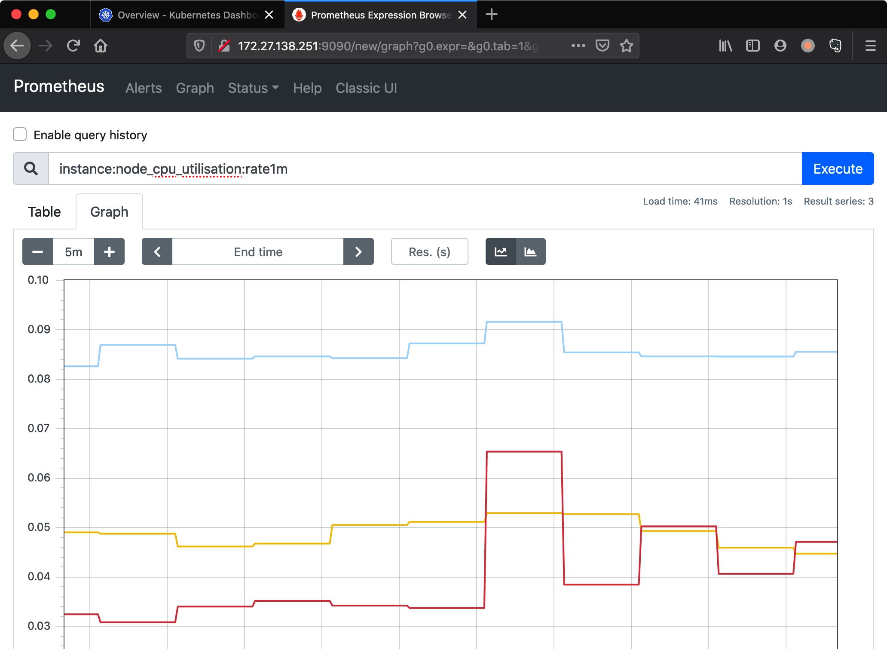
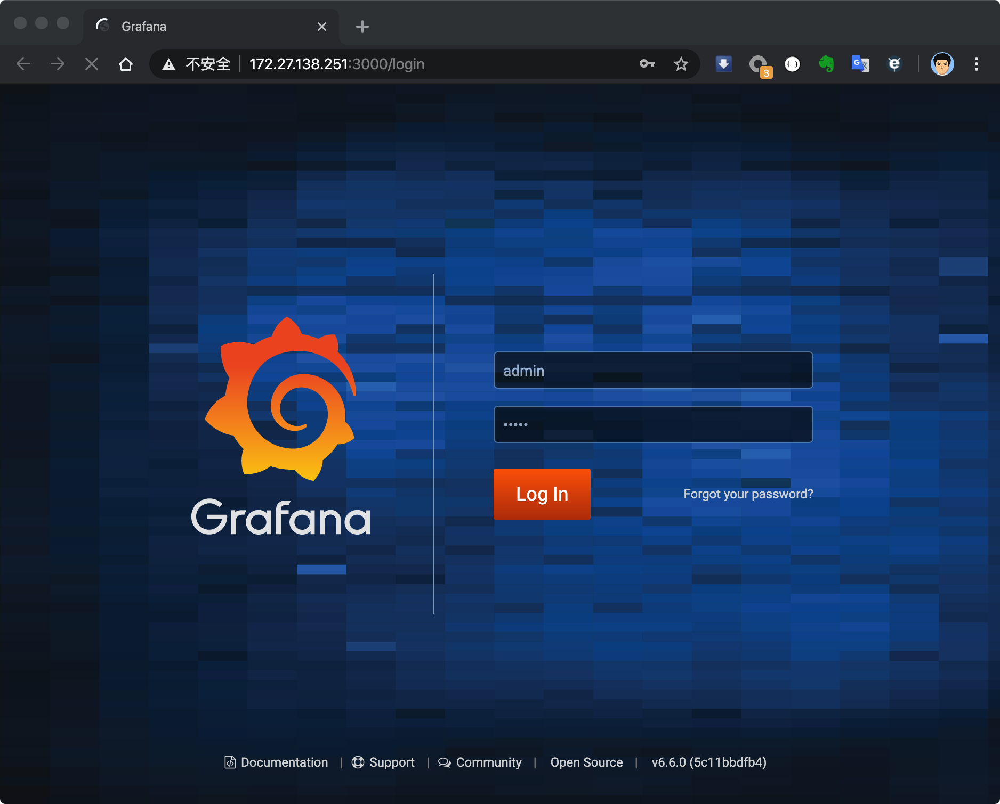
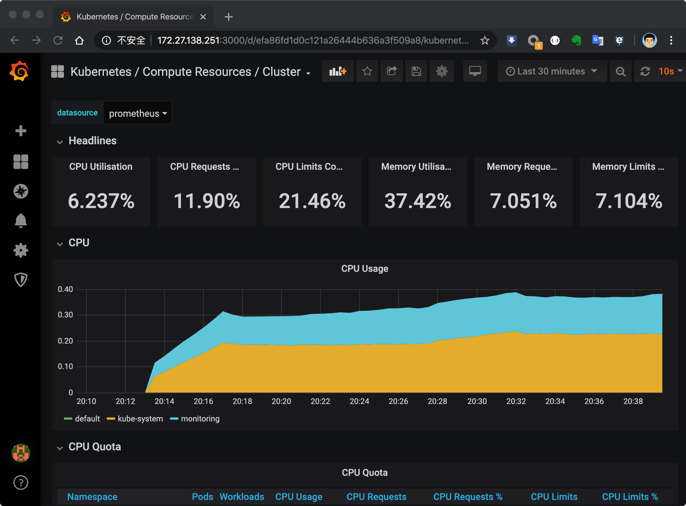

tags: addons, kube-prometheus, prometheus, grafana

# 08-4. 部署 kube-prometheus 插架
<!-- TOC -->

- [08-4. 部署 kube-prometheus 插架](#08-4-部署-kube-prometheus-插架)
    - [下载和安装](#下载和安装)
    - [查看运行状态](#查看运行状态)
    - [访问 Prometheus UI](#访问-prometheus-ui)
    - [访问 Grafana UI](#访问-grafana-ui)

<!-- /TOC -->

kube-prometheus 是一整套监控解决方案，它使用 Prometheus 采集集群指标，Grafana 做展示，包含如下组件：
+ The Prometheus Operator
+ Highly available Prometheus
+ Highly available Alertmanager
+ Prometheus node-exporter
+ Prometheus Adapter for Kubernetes Metrics APIs （k8s-prometheus-adapter）
+ kube-state-metrics
+ Grafana

其中 k8s-prometheus-adapter 使用 Prometheus 实现了 metrics.k8s.io 和 custom.metrics.k8s.io API，所以**不需要再部署** `metrics-server`。
如果要单独部署 `metrics-server`，请参考：[C.metrics-server插件.md](C.metrics-server插件.md)

如果没有特殊指明，本文档的所有操作**均在 zhangjun-k8s-01 节点上执行**；

## 下载和安装

``` bash
cd /opt/k8s/work
git clone https://github.com/coreos/kube-prometheus.git
cd kube-prometheus/
sed -i -e 's_quay.io_quay.mirrors.ustc.edu.cn_' manifests/*.yaml manifests/setup/*.yaml # 使用中科大的 Registry
kubectl apply -f manifests/setup # 安装 prometheus-operator
kubectl apply -f manifests/ # 安装 promethes metric adapter
```

## 查看运行状态

``` bash
$ kubectl get pods -n monitoring
NAME                                   READY   STATUS    RESTARTS   AGE
alertmanager-main-0                    2/2     Running       0          63s
alertmanager-main-1                    2/2     Running       0          63s
alertmanager-main-2                    2/2     Running       0          63s
grafana-76b8d59b9b-nd6gk               1/1     Running       0          11m
kube-state-metrics-67b7c5dc78-sktzg    3/3     Running       0          73s
node-exporter-prsvf                    2/2     Running       0          34s
node-exporter-qdh6n                    2/2     Running       0          71s
node-exporter-z6h4z                    2/2     Running       0          69s
prometheus-adapter-5f46ccd66d-bbsns    1/1     Running       0          73s
prometheus-k8s-0                       3/3     Running       1          53s
prometheus-k8s-1                       3/3     Running       1          53s
prometheus-operator-6d8b95b467-htx56   1/1     Running       0          74s
```

``` bash
$ kubectl top pods -n monitoring
NAME                                  CPU(cores)   MEMORY(bytes)   
alertmanager-main-0                    0m           18Mi            
alertmanager-main-1                    2m           20Mi            
alertmanager-main-2                    0m           19Mi            
grafana-76b8d59b9b-nd6gk               4m           49Mi            
kube-state-metrics-67b7c5dc78-sktzg    11m          29Mi            
kube-state-metrics-959876458-cjtr5     9m           37Mi            
node-exporter-prsvf                    4m           11Mi            
node-exporter-qdh6n                    1m           20Mi            
node-exporter-z6h4z                    5m           11Mi            
prometheus-adapter-5f46ccd66d-bbsns    0m           17Mi            
prometheus-k8s-0                       15m          190Mi           
prometheus-k8s-1                       6m           199Mi           
prometheus-operator-6d8b95b467-htx56   0m           20Mi   
```

## 访问 Prometheus UI

启动服务代理：

``` bash
$ 
$ kubectl port-forward --address 0.0.0.0 pod/prometheus-k8s-0 -n monitoring 9090:9090
Forwarding from 0.0.0.0:9090 -> 9090
```
+ port-forward 依赖 socat。

浏览器访问：http://172.27.138.251:9090/new/graph?g0.expr=&g0.tab=1&g0.stacked=0&g0.range_input=1h




## 访问 Grafana UI

启动代理：

``` bash
$ kubectl port-forward --address 0.0.0.0 svc/grafana -n monitoring 3000:3000 
Forwarding from 0.0.0.0:3000 -> 3000
```

浏览器访问：http://172.27.138.251:3000/

用 admin/admin 登录：


然后，就可以看到各种预定义的 dashboard 了：


