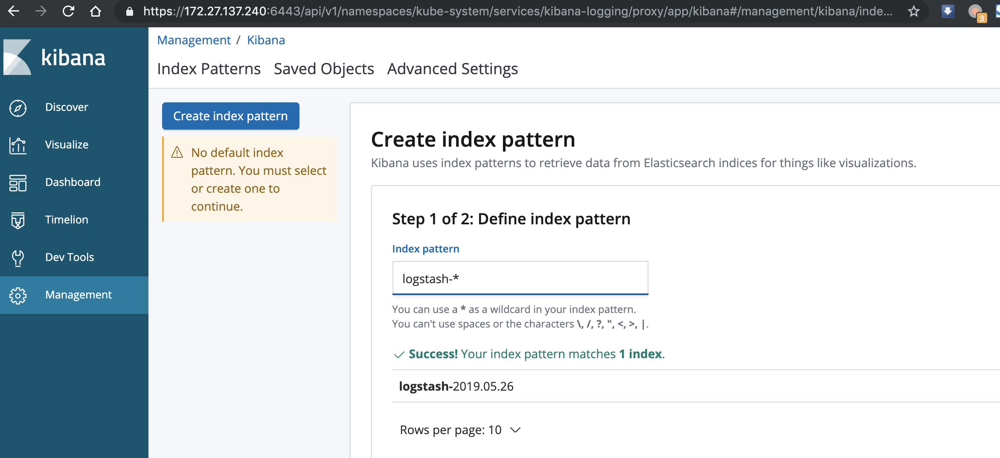
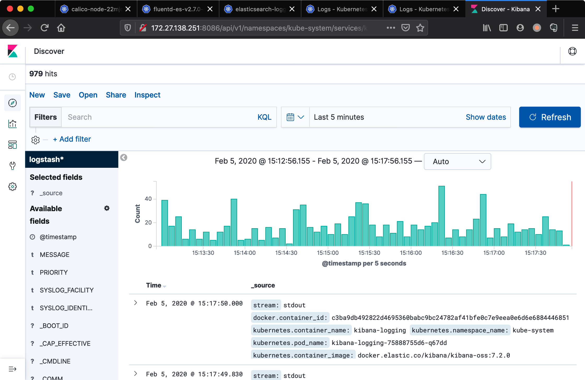

tags: addons, EFK, fluentd, elasticsearch, kibana

# 08-5. 部署 EFK 插件

<!-- TOC -->

- [08-5. 部署 EFK 插件](#08-5-部署-efk-插件)
    - [修改配置文件](#修改配置文件)
    - [执行定义文件](#执行定义文件)
    - [检查执行结果](#检查执行结果)
    - [通过 kubectl proxy 访问 kibana](#通过-kubectl-proxy-访问-kibana)

<!-- /TOC -->

注意：
1. 如果没有特殊指明，本文档的所有操作**均在 zhangjun-k8s-01 节点上执行**。
2. kuberntes 自带插件的 manifests yaml 文件使用 gcr.io 的 docker registry，国内被墙，需要**手动替换**为其它 registry 地址；
3. 可以从微软中国提供的 [gcr.io 免费代理](http://mirror.azure.cn/help/gcr-proxy-cache.html)下载被墙的镜像；

## 修改配置文件

将下载的 kubernetes-server-linux-amd64.tar.gz 解压后，再解压其中的 kubernetes-src.tar.gz 文件。

``` bash
cd /opt/k8s/work/kubernetes/
tar -xzvf kubernetes-src.tar.gz
```

EFK 目录是 `kubernetes/cluster/addons/fluentd-elasticsearch`。

``` bash
cd /opt/k8s/work/kubernetes/cluster/addons/fluentd-elasticsearch
sed -i -e 's_quay.io_quay.azk8s.cn_' es-statefulset.yaml # 使用微软的 Registry
sed -i -e 's_quay.io_quay.azk8s.cn_' fluentd-es-ds.yaml # 使用微软的 Registry
```

## 执行定义文件

``` bash
cd /opt/k8s/work/kubernetes/cluster/addons/fluentd-elasticsearch
kubectl apply -f .
```

## 检查执行结果

``` bash
$ kubectl get all -n kube-system |grep -E 'elasticsearch|fluentd|kibana'
pod/elasticsearch-logging-0                   1/1     Running   0          15m
pod/elasticsearch-logging-1                   1/1     Running   0          14m
pod/fluentd-es-v2.7.0-98slb                   1/1     Running   0          15m
pod/fluentd-es-v2.7.0-v25tz                   1/1     Running   0          15m
pod/fluentd-es-v2.7.0-zngpm                   1/1     Running   0          15m
pod/kibana-logging-75888755d6-nw6bc           1/1     Running   0          5m40s
service/elasticsearch-logging   ClusterIP   10.254.11.19     <none>        9200/TCP                 15m
service/kibana-logging          ClusterIP   10.254.207.146   <none>        5601/TCP                 15m
daemonset.apps/fluentd-es-v2.7.0   3         3         3       3            3           <none>                   15m
deployment.apps/kibana-logging            1/1     1            1           15m
replicaset.apps/kibana-logging-75888755d6           1         1         1       15m
statefulset.apps/elasticsearch-logging   2/2     15m
```

kibana Pod 第一次启动时会用**较长时间(0-20分钟)**来优化和 Cache 状态页面，可以 tailf 该 Pod 的日志观察进度：

``` bash
$ kubectl logs kibana-logging-75888755d6-nw6bc -n kube-system -f
```

注意：只有当 Kibana pod 启动完成后，浏览器才能查看 kibana dashboard，否则会被拒绝。

## 通过 kubectl proxy 访问 kibana

创建代理：

``` bash
$ kubectl proxy --address='172.27.138.251' --port=8086 --accept-hosts='^*$'
Starting to serve on 172.27.138.251:8086
```

浏览器访问 URL：`http://172.27.138.251:8086/api/v1/namespaces/kube-system/services/kibana-logging/proxy`
    
在 Management -> Indices 页面创建一个 index（相当于 mysql 中的一个 database），选中 `Index contains time-based events`，使用默认的 `logstash-*` pattern，点击 `Create` ;



创建 Index 后，稍等几分钟就可以在 `Discover` 菜单下看到 ElasticSearch logging 中汇聚的日志；

