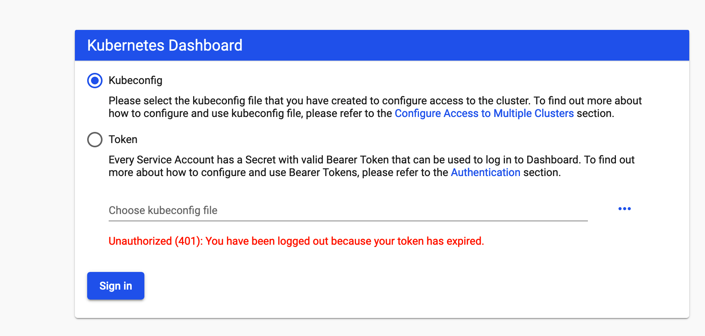
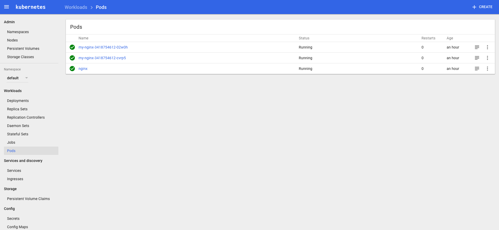

<!-- toc -->

tags: dashboard

# 部署 dashboard 插件

官方文件目录：`kubernetes/cluster/addons/dashboard`

使用的文件：

``` bash
$ cd /opt/k8s/work/kubernetes/cluster/addons/dashboard

$ ls *.yaml
dashboard-configmap.yaml  dashboard-controller.yaml  dashboard-rbac.yaml  dashboard-secret.yaml  dash
```

## 配置 dashboard-service

``` bash
$ cp  dashboard-service.yaml dashboard-service.yaml.orig
$ diff dashboard-service.yaml.orig dashboard-service.yaml
10a11
>   type: NodePort
```

+ 指定端口类型为 NodePort，这样外界可以通过地址 nodeIP:nodePort 访问 dashboard；

## 执行所有定义文件

``` bash
$ kubectl create -f  .
```

## 检查执行结果

查看分配的 NodePort

``` bash
$ kubectl get services kubernetes-dashboard -n kube-system
NAME                   TYPE       CLUSTER-IP      EXTERNAL-IP   PORT(S)         AGE
kubernetes-dashboard   NodePort   10.254.18.208   <none>        443:31772/TCP   8s
```

+ NodePort 31772 映射到 dashboard pod 443 端口；

检查 controller

``` bash
$ kubectl get deployment kubernetes-dashboard  -n kube-system
NAME                   DESIRED   CURRENT   UP-TO-DATE   AVAILABLE   AGE
kubernetes-dashboard   1         1         1            1           1m

$ kubectl get pods  -n kube-system | grep dashboard
kubernetes-dashboard-6bb875b5bc-t486k   1/1       Running   0          38s
```


## 访问 dashboard

为了集群安全，从 1.7 开始，dashboard 只允许通过 https 访问，如果使用 kube proxy 则必须监听 localhost 或 127.0.0.1，对于 NodePort 没有这个限制，但是仅建议在开发环境中使用。

对于不满足这些条件的登录访问，在登录成功后**浏览器不跳转，始终停在登录界面**。

参考：
https://github.com/kubernetes/dashboard/wiki/Accessing-Dashboard---1.7.X-and-above
https://github.com/kubernetes/dashboard/issues/2540

1. kubernetes-dashboard 服务暴露了 NodePort，可以使用 `https://NodeIP:NodePort` 地址访问 dashboard；
1. 通过 kube-apiserver 访问 dashboard；
1. 通过 kubectl proxy 访问 dashboard：

### 通过 kubectl proxy 访问 dashboard

启动代理：

``` bash
$ kubectl proxy --address='localhost' --port=8086 --accept-hosts='^*$' --kubeconfig ~/.kube/config
Starting to serve on 127.0.0.1:8086
```
+ --address 必须为 localhost 或 127.0.0.1；
+ 需要指定 `--accept-hosts` 选项，否则浏览器访问 dashboard 页面时提示 “Unauthorized”；

浏览器访问 URL：`http://127.0.0.1:8086/api/v1/namespaces/kube-system/services/https:kubernetes-dashboard:/proxy`

### 通过 kube-apiserver 访问 dashboard

获取集群服务地址列表：

``` bash
$ kubectl cluster-info
Kubernetes master is running at https://172.27.128.252:8443
CoreDNS is running at https://172.27.128.252:8443/api/v1/namespaces/kube-system/services/kube-dns/proxy
kubernetes-dashboard is running at https://172.27.128.252:8443/api/v1/namespaces/kube-system/services/kubernetes-dashboard/proxy

To further debug and diagnose cluster problems, use 'kubectl cluster-info dump'.
```

必须通过 kube-apiserver 的安全端口(https)访问 dashbaord，访问时浏览器需要使用**自定义证书**，否则会被 kube-apiserver 拒绝访问。

创建和导入自定义证书的步骤，参考：[A.浏览器访问kube-apiserver安全端口](A.浏览器访问kube-apiserver安全端口.md)

浏览器访问 URL：`https://172.27.128.252:8443/api/v1/namespaces/kube-system/services/https:kubernetes-dashboard:/proxy/`



## 创建登录 Dashboard 的 token 和 kubeconfig 配置文件

上面提到，Dashboard 默认只支持 token 认证，所以如果使用 KubeConfig 文件，需要在该文件中指定 token，不支持使用 client 证书认证。

### 创建登录 token

``` bash
kubectl create sa dashboard-admin -n kube-system
kubectl create clusterrolebinding dashboard-admin --clusterrole=cluster-admin --serviceaccount=kube-system:dashboard-admin
ADMIN_SECRET=$(kubectl get secrets -n kube-system | grep dashboard-admin | awk '{print $1}')
DASHBOARD_LOGIN_TOKEN=$(kubectl describe secret -n kube-system ${ADMIN_SECRET} | grep -E '^token' | awk '{print $2}')
echo ${DASHBOARD_LOGIN_TOKEN}
```

使用输出的 token 登录 Dashboard。

### 创建使用 token 的 KubeConfig 文件

``` bash
cd /opt/k8s/work
source /opt/k8s/bin/environment.sh
# 设置集群参数
kubectl config set-cluster kubernetes \
  --certificate-authority=/opt/k8s/work/ca.pem \
  --embed-certs=true \
  --server=${KUBE_APISERVER} \
  --kubeconfig=dashboard.kubeconfig

# 设置客户端认证参数，使用上面创建的 Token
kubectl config set-credentials dashboard_user \
  --token=${DASHBOARD_LOGIN_TOKEN} \
  --kubeconfig=dashboard.kubeconfig

# 设置上下文参数
kubectl config set-context default \
  --cluster=kubernetes \
  --user=dashboard_user \
  --kubeconfig=dashboard.kubeconfig

# 设置默认上下文
kubectl config use-context default --kubeconfig=dashboard.kubeconfig
```

用生成的 dashboard.kubeconfig  登录 Dashboard。



由于缺少 Heapster 插件，当前 dashboard 不能展示 Pod、Nodes 的 CPU、内存等统计数据和图表；

## 参考
https://github.com/kubernetes/dashboard/wiki/Access-control
https://github.com/kubernetes/dashboard/issues/2558
https://kubernetes.io/docs/concepts/configuration/organize-cluster-access-kubeconfig/