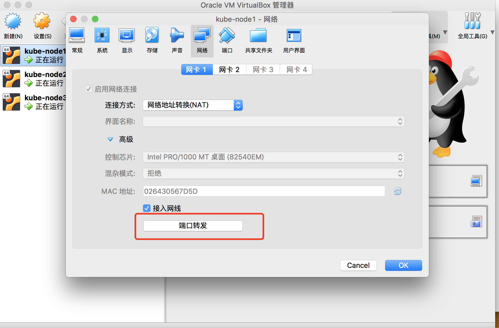
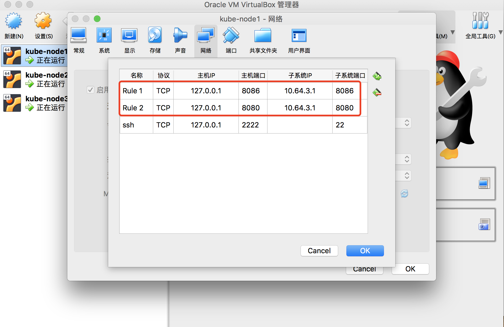

tags: addons, dashboard

# 09-2.部署 dashboard 插件

<!-- TOC -->

- [09-2.部署 dashboard 插件](#09-2部署-dashboard-插件)
    - [修改配置文件](#修改配置文件)
    - [执行所有定义文件](#执行所有定义文件)
    - [查看分配的 NodePort](#查看分配的-nodeport)
    - [查看 dashboard 支持的命令行参数](#查看-dashboard-支持的命令行参数)
    - [访问 dashboard](#访问-dashboard)
        - [通过 kubectl proxy 访问 dashboard](#通过-kubectl-proxy-访问-dashboard)
        - [通过 kube-apiserver 访问 dashboard](#通过-kube-apiserver-访问-dashboard)
    - [创建登录 Dashboard 的 token 和 kubeconfig 配置文件](#创建登录-dashboard-的-token-和-kubeconfig-配置文件)
        - [创建登录 token](#创建登录-token)
        - [创建使用 token 的 KubeConfig 文件](#创建使用-token-的-kubeconfig-文件)
    - [参考](#参考)

<!-- /TOC -->

注意：
1. 如果没有特殊指明，本文档的所有操作**均在 zhangjun-k8s01 节点上执行**；
2. kuberntes 自带插件的 manifests yaml 文件使用 gcr.io 的 docker registry，国内被墙，需要**手动替换**为其它 registry 地址（本文档未替换）；

## 修改配置文件

将下载的 kubernetes-server-linux-amd64.tar.gz 解压后，再解压其中的 kubernetes-src.tar.gz 文件。

``` bash
cd /opt/k8s/work/kubernetes/
tar -xzvf kubernetes-src.tar.gz
```

dashboard 对应的目录是：`cluster/addons/dashboard`：

``` bash
cd /opt/k8s/work/kubernetes/cluster/addons/dashboard
```

修改 service 定义，指定端口类型为 NodePort，这样外界可以通过地址 NodeIP:NodePort 访问 dashboard；

``` bash
$ cat dashboard-service.yaml
apiVersion: v1
kind: Service
metadata:
  name: kubernetes-dashboard
  namespace: kube-system
  labels:
    k8s-app: kubernetes-dashboard
    kubernetes.io/cluster-service: "true"
    addonmanager.kubernetes.io/mode: Reconcile
spec:
  type: NodePort # 增加这一行
  selector:
    k8s-app: kubernetes-dashboard
  ports:
  - port: 443
    targetPort: 8443
```

## 执行所有定义文件

``` bash
$ ls *.yaml
dashboard-configmap.yaml  dashboard-controller.yaml  dashboard-rbac.yaml  dashboard-secret.yaml  dashboard-service.yaml

$ kubectl apply -f  .
```

## 查看分配的 NodePort

``` bash
$ kubectl get deployment kubernetes-dashboard  -n kube-system
NAME                   DESIRED   CURRENT   UP-TO-DATE   AVAILABLE   AGE
kubernetes-dashboard   1         1         1            1           2m

$ kubectl --namespace kube-system get pods -o wide
NAME                                    READY   STATUS    RESTARTS   AGE   IP            NODE             NOMINATED NODE   READINESS GATES
coredns-5b969f4c88-jb6jg                1/1     Running   0          72m   172.30.80.3   zhangjun-k8s01   <none>           <none>
kubernetes-dashboard-85bcf5dbf8-5l56v   1/1     Running   0          27s   172.30.80.6   zhangjun-k8s01   <none>           <none>

$ kubectl get services kubernetes-dashboard -n kube-system
NAME                   TYPE       CLUSTER-IP       EXTERNAL-IP   PORT(S)         AGE
kubernetes-dashboard   NodePort   10.254.249.138   <none>        443:32731/TCP   42s
```
+ NodePort 32731 映射到 dashboard pod 443 端口；

## 查看 dashboard 支持的命令行参数

``` bash
$ kubectl exec --namespace kube-system -it kubernetes-dashboard-85bcf5dbf8-5l56v  -- /dashboard --help # kubernetes-dashboard-85bcf5dbf8-5l56v 为 pod 名称
2019/05/26 09:12:16 Starting overwatch
Usage of /dashboard:
      --alsologtostderr                  log to standard error as well as files
      --api-log-level string             Level of API request logging. Should be one of 'INFO|NONE|DEBUG'. Default: 'INFO'. (default "INFO")
      --apiserver-host string            The address of the Kubernetes Apiserver to connect to in the format of protocol://address:port, e.g., http://localhost:8080. If not specified, the assumption is that the binary runs inside a Kubernetes cluster and local discovery is attempted.
      --authentication-mode strings      Enables authentication options that will be reflected on login screen. Supported values: token, basic. Default: token.Note that basic option should only be used if apiserver has '--authorization-mode=ABAC' and '--basic-auth-file' flags set. (default [token])
      --auto-generate-certificates       When set to true, Dashboard will automatically generate certificates used to serve HTTPS. Default: false.
      --bind-address ip                  The IP address on which to serve the --secure-port (set to 0.0.0.0 for all interfaces). (default 0.0.0.0)
      --default-cert-dir string          Directory path containing '--tls-cert-file' and '--tls-key-file' files. Used also when auto-generating certificates flag is set. (default "/certs")
      --disable-settings-authorizer      When enabled, Dashboard settings page will not require user to be logged in and authorized to access settings page.
      --enable-insecure-login            When enabled, Dashboard login view will also be shown when Dashboard is not served over HTTPS. Default: false.
      --enable-skip-login                When enabled, the skip button on the login page will be shown. Default: false.
      --heapster-host string             The address of the Heapster Apiserver to connect to in the format of protocol://address:port, e.g., http://localhost:8082. If not specified, the assumption is that the binary runs inside a Kubernetes cluster and service proxy will be used.
      --insecure-bind-address ip         The IP address on which to serve the --port (set to 0.0.0.0 for all interfaces). (default 127.0.0.1)
      --insecure-port int                The port to listen to for incoming HTTP requests. (default 9090)
      --kubeconfig string                Path to kubeconfig file with authorization and master location information.
      --log_backtrace_at traceLocation   when logging hits line file:N, emit a stack trace (default :0)
      --log_dir string                   If non-empty, write log files in this directory
      --logtostderr                      log to standard error instead of files
      --metric-client-check-period int   Time in seconds that defines how often configured metric client health check should be run. Default: 30 seconds. (default 30)
      --port int                         The secure port to listen to for incoming HTTPS requests. (default 8443)
      --stderrthreshold severity         logs at or above this threshold go to stderr (default 2)
      --system-banner string             When non-empty displays message to Dashboard users. Accepts simple HTML tags. Default: ''.
      --system-banner-severity string    Severity of system banner. Should be one of 'INFO|WARNING|ERROR'. Default: 'INFO'. (default "INFO")
      --tls-cert-file string             File containing the default x509 Certificate for HTTPS.
      --tls-key-file string              File containing the default x509 private key matching --tls-cert-file.
      --token-ttl int                    Expiration time (in seconds) of JWE tokens generated by dashboard. Default: 15 min. 0 - never expires (default 900)
  -v, --v Level                          log level for V logs
      --vmodule moduleSpec               comma-separated list of pattern=N settings for file-filtered logging
pflag: help requested
command terminated with exit code 2
```

dashboard 的 `--authentication-mode` 支持 token、basic，默认为 token。如果使用 basic，则 kube-apiserver 必须配置 `--authorization-mode=ABAC` 和 `--basic-auth-file` 参数。

## 访问 dashboard

从 1.7 开始，dashboard 只允许通过 https 访问，如果使用 kube proxy 则必须监听 localhost 或 127.0.0.1。对于 NodePort 没有这个限制，但是仅建议在开发环境中使用。

对于不满足这些条件的登录访问，在登录成功后**浏览器不跳转，始终停在登录界面**。

1. kubernetes-dashboard 服务暴露了 NodePort，可以使用 `https://NodeIP:NodePort` 地址访问 dashboard；
2. 通过 kube-apiserver 访问 dashboard；
3. 通过 kubectl proxy 访问 dashboard：

如果使用了 VirtualBox，需要启用 VirtualBox 的 ForworadPort 功能将虚机监听的端口和 Host 的本地端口绑定。

可以在 Vagrant 的配置中指定这些端口转发规则，对于正在运行的虚机，也可以通过 VirtualBox 的界面进行配置：




### 通过 kubectl proxy 访问 dashboard

启动代理：

``` bash
$ kubectl proxy --address='localhost' --port=8086 --accept-hosts='^*$'
Starting to serve on 127.0.0.1:8086
```
+ --address 必须为 localhost 或 127.0.0.1；
+ 需要指定 `--accept-hosts` 选项，否则浏览器访问 dashboard 页面时提示 “Unauthorized”；

浏览器访问 URL：`http://127.0.0.1:8086/api/v1/namespaces/kube-system/services/https:kubernetes-dashboard:/proxy`

### 通过 kube-apiserver 访问 dashboard

获取集群服务地址列表：

``` bash
$ kubectl cluster-info
Kubernetes master is running at https://127.0.0.1:8443
CoreDNS is running at https://127.0.0.1:8443/api/v1/namespaces/kube-system/services/kube-dns:dns/proxy
kubernetes-dashboard is running at https://127.0.0.1:8443/api/v1/namespaces/kube-system/services/https:kubernetes-dashboard:/proxy

To further debug and diagnose cluster problems, use 'kubectl cluster-info dump'.
```

+ 由于 apiserver 通过本地的 kube-nginx 做了代理，所以上面显示的 127.0.0.1:8443 为本地的 kube-nginx 的 IP 和 Port，浏览器访问时需要替换为 kube-apiserver 实际监听的 IP 和端口，如 172.27.137.240:6443；
+ 必须通过 kube-apiserver 的安全端口(https)访问 dashbaord，访问时浏览器需要使用**自定义证书**，否则会被 kube-apiserver 拒绝访问。
+ 创建和导入自定义证书的步骤，参考：[A.浏览器访问kube-apiserver安全端口](A.浏览器访问kube-apiserver安全端口.md)

浏览器访问 URL：`https://172.27.137.240:6443/api/v1/namespaces/kube-system/services/https:kubernetes-dashboard:/proxy`
对于 virtuabox 做了端口映射： `http://127.0.0.1:6443/api/v1/namespaces/kube-system/services/https:kubernetes-dashboard:/proxy/`


## 创建登录 Dashboard 的 token 和 kubeconfig 配置文件

dashboard 默认只支持 token 认证（不支持 client 证书认证），所以如果使用 Kubeconfig 文件，需要将 token 写入到该文件。

### 创建登录 token

``` bash
kubectl create sa dashboard-admin -n kube-system
kubectl create clusterrolebinding dashboard-admin --clusterrole=cluster-admin --serviceaccount=kube-system:dashboard-admin
ADMIN_SECRET=$(kubectl get secrets -n kube-system | grep dashboard-admin | awk '{print $1}')
DASHBOARD_LOGIN_TOKEN=$(kubectl describe secret -n kube-system ${ADMIN_SECRET} | grep -E '^token' | awk '{print $2}')
echo ${DASHBOARD_LOGIN_TOKEN}
```

使用输出的 token 登录 Dashboard。

### 创建使用 token 的 KubeConfig 文件

``` bash
source /opt/k8s/bin/environment.sh
# 设置集群参数
kubectl config set-cluster kubernetes \
  --certificate-authority=/etc/kubernetes/cert/ca.pem \
  --embed-certs=true \
  --server=${KUBE_APISERVER} \
  --kubeconfig=dashboard.kubeconfig

# 设置客户端认证参数，使用上面创建的 Token
kubectl config set-credentials dashboard_user \
  --token=${DASHBOARD_LOGIN_TOKEN} \
  --kubeconfig=dashboard.kubeconfig

# 设置上下文参数
kubectl config set-context default \
  --cluster=kubernetes \
  --user=dashboard_user \
  --kubeconfig=dashboard.kubeconfig

# 设置默认上下文
kubectl config use-context default --kubeconfig=dashboard.kubeconfig
```

用生成的 dashboard.kubeconfig 登录 Dashboard。


由于缺少 Heapster 插件，当前 dashboard 不能展示 Pod、Nodes 的 CPU、内存等统计数据和图表。

## 参考

1. https://github.com/kubernetes/dashboard/wiki/Access-control
2. https://github.com/kubernetes/dashboard/issues/2558
3. https://kubernetes.io/docs/concepts/configuration/organize-cluster-access-kubeconfig/
4. https://github.com/kubernetes/dashboard/wiki/Accessing-Dashboard---1.7.X-and-above
5. https://github.com/kubernetes/dashboard/issues/2540
