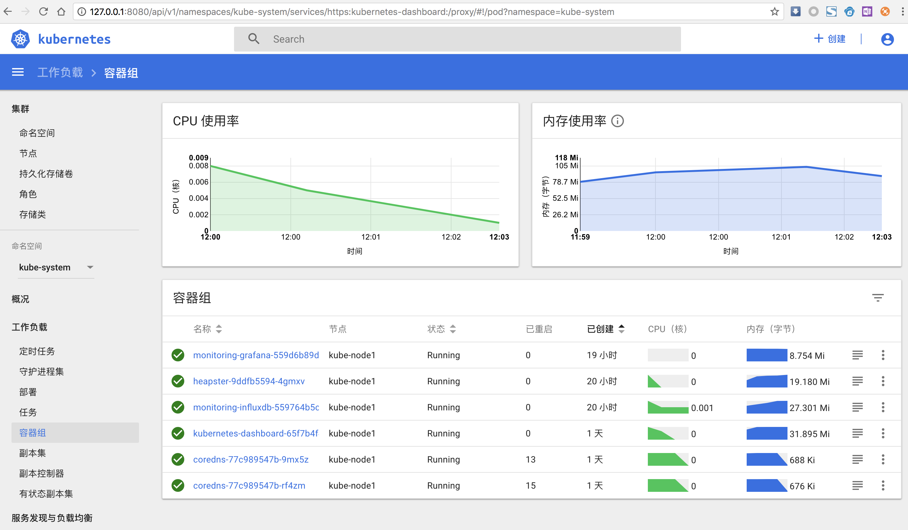
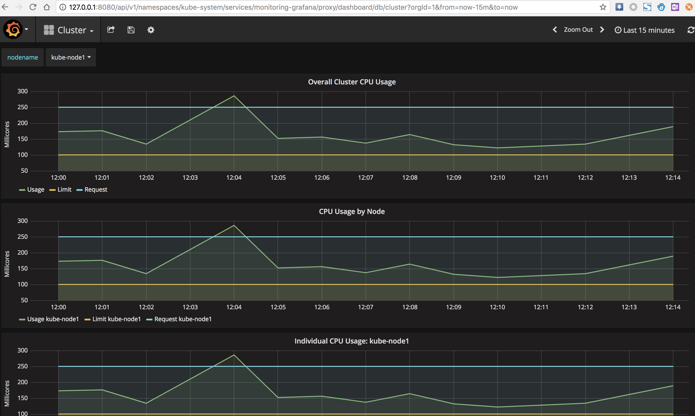

<!-- toc -->

tags: heapster

# 部署 heapster 插件

到 [heapster release 页面](https://github.com/kubernetes/heapster/releases) 下载最新版本的 heapster

``` bash
$ wget https://github.com/kubernetes/heapster/archive/v1.5.2.tar.gz
$ tar -xzvf v1.5.2.tar.gz
$ mv v1.5.2.tar.gz heapster-1.5.2.tar.gz
$
```

官方文件目录： `heapster-1.5.2/deploy/kube-config/influxdb`

已经修改好的 yaml 文件见：[heapster](https://github.com/opsnull/follow-me-install-kubernetes-cluster/blob/master/manifests/heapster)。

## 修改配置

``` bash
$ cd /opt/k8s/heapster-1.5.2/deploy/kube-config/influxdb
$ cp grafana.yaml{,.bak}
$ diff grafana.yaml.bak grafana.yaml
16c16
<         image: gcr.io/google_containers/heapster-grafana-amd64:v4.4.3
---
>         image: wanghkkk/heapster-grafana-amd64-v4.4.3:v4.4.3
43,44c43,44
<           # value: /api/v1/namespaces/kube-system/services/monitoring-grafana/proxy
<           value: /
---
>           value: /api/v1/namespaces/kube-system/services/monitoring-grafana/proxy
>           #value: /
```

+ 如果后续使用 kube-apiserver 或者 kubectl proxy 访问 grafana dashboard，则必须将 `GF_SERVER_ROOT_URL` 设置为 `/api/v1/proxy/namespaces/kube-system/services/monitoring-grafana/`，否则后续访问grafana时访问时提示找不到`http://10.64.3.7:8086/api/v1/proxy/namespaces/kube-system/services/monitoring-grafana/api/dashboards/home` 页面；

``` bash
$ diff heapster.yaml.bak heapster.yaml
23c23
<         image: gcr.io/google_containers/heapster-amd64:v1.5.2
---
>         image: wavefronthq/heapster-amd64:v1.5.2

$ diff influxdb.yaml.bak influxdb.yaml
16c16
<         image: gcr.io/google_containers/heapster-influxdb-amd64:v1.3.3
---
>         image: k8sstart/heapster-influxdb-amd64-v1.3.3
```

## 执行所有定义文件

``` bash
$ pwd
/opt/k8s/heapster-1.5.2/deploy/kube-config/influxdb
$ ls *.yaml
grafana.yaml  heapster.yaml  influxdb.yaml
$ kubectl create -f  .
deployment.extensions "monitoring-grafana" created
service "monitoring-grafana" created
serviceaccount "heapster" created
deployment.extensions "heapster" created
service "heapster" created
deployment.extensions "monitoring-influxdb" created
service "monitoring-influxdb" created

$ cd ../rbac/
$ pwd
/opt/k8s/heapster-1.5.2/deploy/kube-config/rbac
$ ls
heapster-rbac.yaml
$ kubectl create -f heapster-rbac.yaml
$
```

## 检查执行结果

检查 Deployment

``` bash
$ kubectl get deployments -n kube-system | grep -E 'heapster|monitoring'
heapster               1         1         1            1           59m
monitoring-grafana     1         1         1            1           59m
monitoring-influxdb    1         1         1            1           59m
```

检查 Pods

``` bash
$ kubectl get pods -n kube-system | grep -E 'heapster|monitoring'
heapster-9ddfb5594-4gmxv                1/1       Running   0          1h
monitoring-grafana-559d6b89d7-rkwv6     1/1       Running   0          2m
monitoring-influxdb-559764b5c9-sb28x    1/1       Running   0          1h
```

检查 kubernets dashboard 界面，可以正确显示各 Nodes、Pods 的 CPU、内存、负载等统计数据和图表；



## 访问 grafana

1. 通过 kube-apiserver 访问：

    获取 monitoring-grafana 服务 URL

    ``` bash
    $ kubectl cluster-info
    Kubernetes master is running at https://172.27.129.80:6443
    CoreDNS is running at https://172.27.129.80:6443/api/v1/namespaces/kube-system/services/coredns:dns/proxy
    Heapster is running at https://172.27.129.80:6443/api/v1/namespaces/kube-system/services/heapster/proxy
    kubernetes-dashboard is running at https://172.27.129.80:6443/api/v1/namespaces/kube-system/services/https:kubernetes-dashboard:/proxy
    monitoring-grafana is running at https://172.27.129.80:6443/api/v1/namespaces/kube-system/services/monitoring-grafana/proxy
    monitoring-influxdb is running at https://172.27.129.80:6443/api/v1/namespaces/kube-system/services/monitoring-influxdb/proxy

    To further debug and diagnose cluster problems, use 'kubectl cluster-info dump'.
    $
    ```

    由于 kube-apiserver 开启了 RBAC 授权，而浏览器访问 kube-apiserver 的时候使用的是匿名证书，所以访问安全端口会导致授权失败。这里需要使用**非安全**端口访问 kube-apiserver：

    浏览器访问 URL： `http://172.27.129.80:8080/api/v1/namespaces/kube-system/services/monitoring-grafana/proxy`
    对于 virtuabox 做了端口映射： `http://127.0.0.1:8080/api/v1/namespaces/kube-system/services/monitoring-grafana/proxy`

1. 通过 kubectl proxy 访问：

    创建代理

    ``` bash
    $ kubectl proxy --address='172.27.129.80' --port=8086 --accept-hosts='^*$'
    Starting to serve on 172.27.129.80:8086
    ```

    浏览器访问 URL：`http://172.27.129.80:8086/api/v1/proxy/namespaces/kube-system/services/monitoring-grafana`
    对于 virtuabox 做了端口映射： `http://127.0.0.1:8086/api/v1/namespaces/kube-system/services/monitoring-grafana/proxy`

