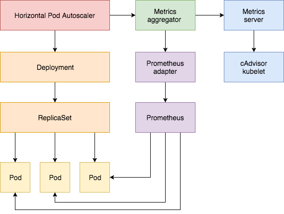

<!-- toc -->

tags: addons, metrics, metrics-server

# 09-4.部署 metrics-server 插件

## 创建 metrics-server 使用的证书

创建 metrics-server 证书签名请求:

``` bash
cat > metrics-server-csr.json <<EOF
{
  "CN": "aggregator",
  "hosts": [],
  "key": {
    "algo": "rsa",
    "size": 2048
  },
  "names": [
    {
      "C": "CN",
      "ST": "BeiJing",
      "L": "BeiJing",
      "O": "k8s",
      "OU": "4Paradigm"
    }
  ]
}
EOF
```
+ 注意： CN 名称为 aggregator，需要与 kube-apiserver 的 --requestheader-allowed-names 参数配置一致；

生成 metrics-server 证书和私钥：

``` bash
cfssl gencert -ca=/etc/kubernetes/cert/ca.pem \
  -ca-key=/etc/kubernetes/cert/ca-key.pem  \
  -config=/etc/kubernetes/cert/ca-config.json  \
  -profile=kubernetes metrics-server-csr.json | cfssljson -bare metrics-server
```

将生成的证书和私钥文件拷贝到 kube-apiserver 节点：

``` bash
source /opt/k8s/bin/environment.sh
scp metrics-server*.pem k8s@${MASTER_NODE}:/etc/kubernetes/cert/
```

## 修改 kubernetes 控制平面组件的配置以支持 metrics-server

### kube-apiserver

添加如下配置参数：

  --requestheader-client-ca-file=/etc/kubernetes/cert/ca.pem
  --requestheader-allowed-names=""
  --requestheader-extra-headers-prefix="X-Remote-Extra-"
  --requestheader-group-headers=X-Remote-Group
  --requestheader-username-headers=X-Remote-User
  --proxy-client-cert-file=/etc/kubernetes/cert/metrics-server.pem
  --proxy-client-key-file=/etc/kubernetes/cert/metrics-server-key.pem
  --runtime-config=api/all=true

+ `--requestheader-XXX`、`--proxy-client-XXX` 是 kube-apiserver 的 aggregator layer 相关的配置参数，metrics-server & HPA 需要使用；
+ `--requestheader-client-ca-file`：用于签名 `--proxy-client-cert-file` 和 `--proxy-client-key-file` 指定的证书；在启用了 metric aggregator 时使用；
+ 如果 --requestheader-allowed-names 不为空，则--proxy-client-cert-file 证书的 CN 必须位于 allowed-names 中，默认为 aggregator;

如果 kube-apiserver 机器**没有**运行 kube-proxy，则还需要添加 `--enable-aggregator-routing=true` 参数；

关于 `--requestheader-XXX` 相关参数，参考：

+ https://github.com/kubernetes-incubator/apiserver-builder/blob/master/docs/concepts/auth.md
+ https://docs.bitnami.com/kubernetes/how-to/configure-autoscaling-custom-metrics/

注意：requestheader-client-ca-file 指定的 CA 证书，必须具有 client auth and server auth；

### kube-controllr-manager

添加如下配置参数：

  --horizontal-pod-autoscaler-use-rest-clients=true

用于配置 HPA 控制器使用 REST 客户端获取 metrics 数据。

## 整体架构



## 修改插件配置文件配置文件

metrics-server 插件位于 kubernetes 的 `cluster/addons/metrics-server/` 目录下。

修改 metrics-server-deployment 文件：

``` bash
$ cp metrics-server-deployment.yaml{,.orig}
$ diff metrics-server-deployment.yaml.orig metrics-server-deployment.yaml
51c51
<         image: mirrorgooglecontainers/metrics-server-amd64:v0.2.1
---
>         image: k8s.gcr.io/metrics-server-amd64:v0.2.1
54c54
<         - --source=kubernetes.summary_api:''
---
>         - --source=kubernetes.summary_api:https://kubernetes.default?kubeletHttps=true&kubeletPort=10250
60c60
<         image: siriuszg/addon-resizer:1.8.1
---
>         image: k8s.gcr.io/addon-resizer:1.8.1
```
+ metrics-server 的参数格式与 heapster 类似。由于 kubelet 只在 10250 监听 https 请求，故添加相关参数；

授予 kube-system:metrics-server ServiceAccount 访问 kubelet API 的权限：

``` bash
$ cat auth-kubelet.yaml
apiVersion: rbac.authorization.k8s.io/v1
kind: ClusterRoleBinding
metadata:
  name: metrics-server:system:kubelet-api-admin
  labels:
    kubernetes.io/cluster-service: "true"
    addonmanager.kubernetes.io/mode: Reconcile
roleRef:
  apiGroup: rbac.authorization.k8s.io
  kind: ClusterRole
  name: system:kubelet-api-admin
subjects:
- kind: ServiceAccount
  name: metrics-server
  namespace: kube-system
```
+ 新建一个 ClusterRoleBindings 定义文件，授予相关权限；

## 创建 metrics-server

``` bash
$ pwd
/opt/k8s/kubernetes/cluster/addons/metrics-server
$ ls -l *.yaml
-rw-rw-r-- 1 k8s k8s  398 Jun  5 07:17 auth-delegator.yaml
-rw-rw-r-- 1 k8s k8s  404 Jun 16 18:02 auth-kubelet.yaml
-rw-rw-r-- 1 k8s k8s  419 Jun  5 07:17 auth-reader.yaml
-rw-rw-r-- 1 k8s k8s  393 Jun  5 07:17 metrics-apiservice.yaml
-rw-rw-r-- 1 k8s k8s 2640 Jun 16 17:54 metrics-server-deployment.yaml
-rw-rw-r-- 1 k8s k8s  336 Jun  5 07:17 metrics-server-service.yaml
-rw-rw-r-- 1 k8s k8s  801 Jun  5 07:17 resource-reader.yaml
$ kubectl create -f .
```

## 查看运行情况

``` bash
$ kubectl get pods -n kube-system |grep metrics-server
metrics-server-v0.2.1-7486f5bd67-v95q2   2/2       Running   0          45s

$ kubectl get svc -n kube-system|grep metrics-server
metrics-server         ClusterIP   10.254.115.120   <none>        443/TCP         1m
```

## 查看 metrcs-server 输出的 metrics

metrics-server 输出的 APIs：https://github.com/kubernetes/community/blob/master/contributors/design-proposals/instrumentation/resource-metrics-api.md

1. 通过 kube-apiserver 或 kubectl proxy 访问：

  ``` text
  https://172.27.129.105:6443/apis/metrics.k8s.io/v1beta1/nodes
  https://172.27.129.105:6443/apis/metrics.k8s.io/v1beta1/nodes/<node-name>
  https://172.27.129.105:6443/apis/metrics.k8s.io/v1beta1/pods
  https://172.27.129.105:6443/apis/metrics.k8s.io/v1beta1/namespace/<namespace-name>/pods/<pod-name>
  ```

1. 直接使用 kubectl 命令访问：

  ``` text
  kubectl get --raw apis/metrics.k8s.io/v1beta1/nodes
  kubectl get --raw apis/metrics.k8s.io/v1beta1/pods
  kubectl get --raw apis/metrics.k8s.io/v1beta1/nodes/<node-name>
  kubectl get --raw apis/metrics.k8s.io/v1beta1/namespace/<namespace-name>/pods/<pod-name>
  ```

``` bash
$ kubectl get --raw "/apis/metrics.k8s.io/v1beta1" | jq .
{
  "kind": "APIResourceList",
  "apiVersion": "v1",
  "groupVersion": "metrics.k8s.io/v1beta1",
  "resources": [
    {
      "name": "nodes",
      "singularName": "",
      "namespaced": false,
      "kind": "NodeMetrics",
      "verbs": [
        "get",
        "list"
      ]
    },
    {
      "name": "pods",
      "singularName": "",
      "namespaced": true,
      "kind": "PodMetrics",
      "verbs": [
        "get",
        "list"
      ]
    }
  ]
}

$ kubectl get --raw "/apis/metrics.k8s.io/v1beta1/nodes" | jq .
{
  "kind": "NodeMetricsList",
  "apiVersion": "metrics.k8s.io/v1beta1",
  "metadata": {
    "selfLink": "/apis/metrics.k8s.io/v1beta1/nodes"
  },
  "items": [
    {
      "metadata": {
        "name": "kube-node3",
        "selfLink": "/apis/metrics.k8s.io/v1beta1/nodes/kube-node3",
        "creationTimestamp": "2018-06-16T10:24:03Z"
      },
      "timestamp": "2018-06-16T10:23:00Z",
      "window": "1m0s",
      "usage": {
        "cpu": "133m",
        "memory": "1115728Ki"
      }
    },
    {
      "metadata": {
        "name": "kube-node1",
        "selfLink": "/apis/metrics.k8s.io/v1beta1/nodes/kube-node1",
        "creationTimestamp": "2018-06-16T10:24:03Z"
      },
      "timestamp": "2018-06-16T10:23:00Z",
      "window": "1m0s",
      "usage": {
        "cpu": "221m",
        "memory": "6799908Ki"
      }
    },
    {
      "metadata": {
        "name": "kube-node2",
        "selfLink": "/apis/metrics.k8s.io/v1beta1/nodes/kube-node2",
        "creationTimestamp": "2018-06-16T10:24:03Z"
      },
      "timestamp": "2018-06-16T10:23:00Z",
      "window": "1m0s",
      "usage": {
        "cpu": "76m",
        "memory": "1130180Ki"
      }
    }
  ]
}
```
+ /apis/metrics.k8s.io/v1beta1/nodes 和 /apis/metrics.k8s.io/v1beta1/pods 返回的 usage 包含 CPU 和 Memory；

## 参考：
1. https://kubernetes.feisky.xyz/zh/addons/metrics.html
1. metrics-server RBAC：https://github.com/kubernetes-incubator/metrics-server/issues/40
1. metrics-server 参数：https://github.com/kubernetes-incubator/metrics-server/issues/25
1. https://kubernetes.io/docs/tasks/debug-application-cluster/core-metrics-pipeline/