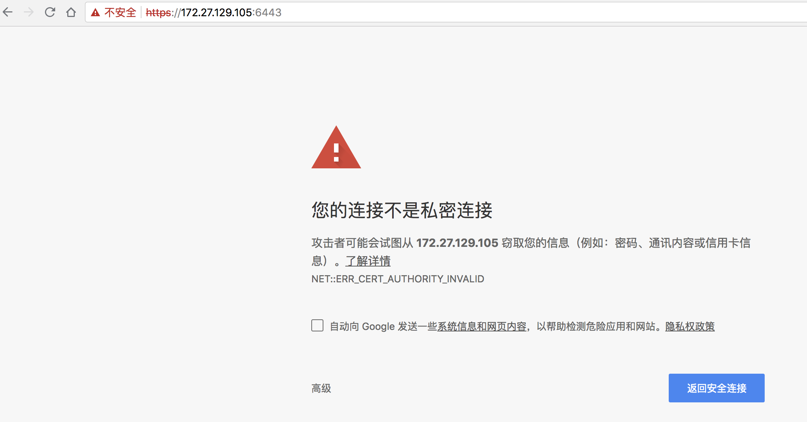
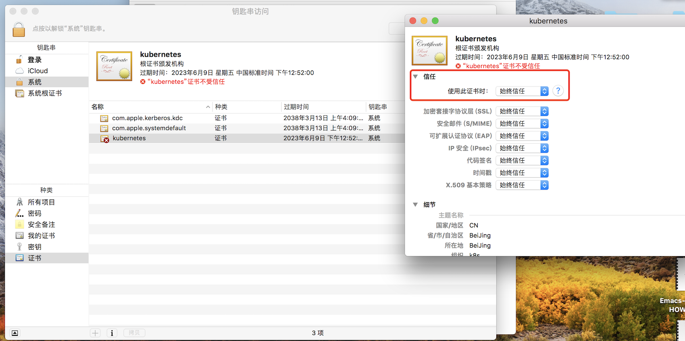
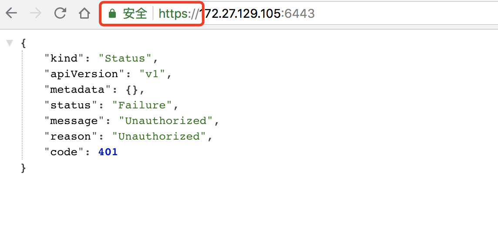
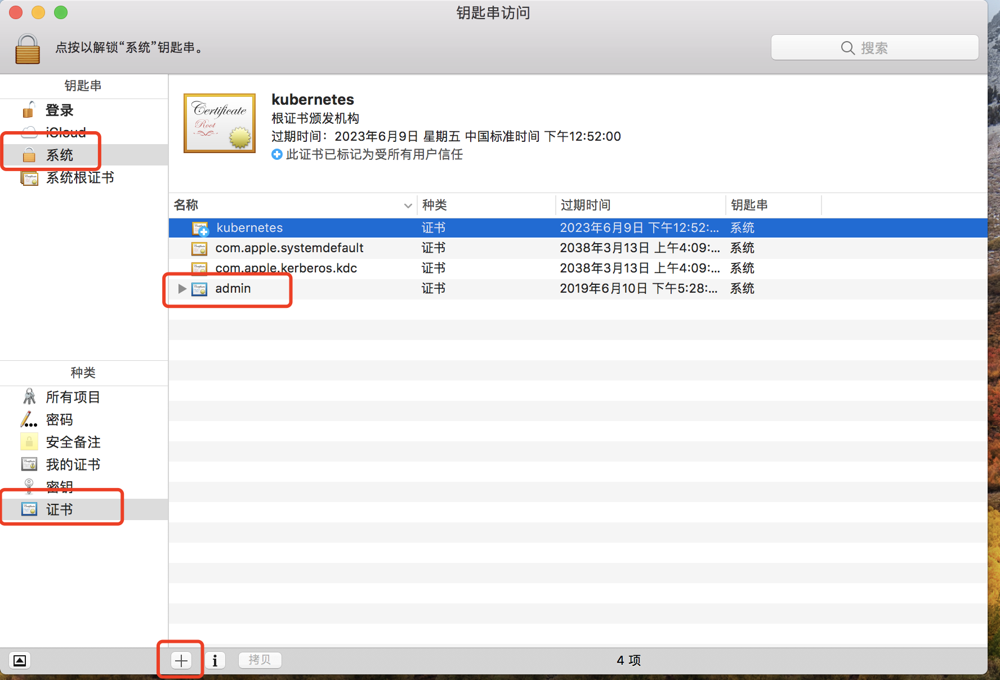
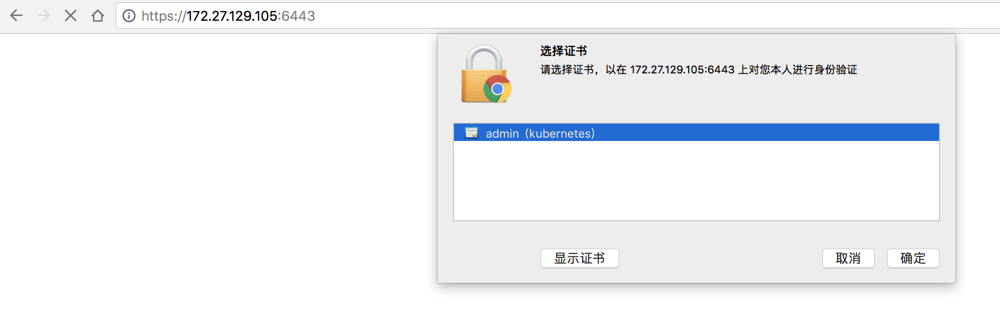
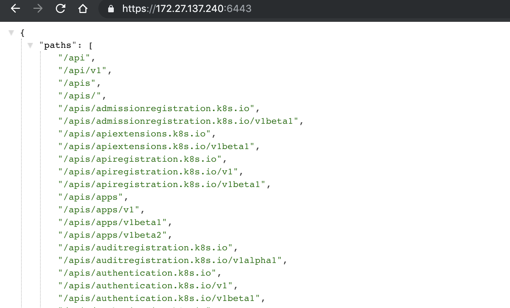

# A. 浏览器访问 kube-apiserver 安全端口

浏览器访问 kube-apiserver 的安全端口 6443 时，提示证书不被信任：



这是因为 kube-apiserver 的 server 证书是我们创建的根证书 ca.pem 签名的，需要将根证书 ca.pem 导入操作系统，并设置永久信任。

对于 Mac，操作如下：



对于 windows 系统使用以下命令导入 ca.perm：

``` bash
keytool -import -v -trustcacerts -alias appmanagement -file "PATH...\\ca.pem" -storepass password -keystore cacerts
```

再次访问 [apiserver 地址](https://172.27.138.251:6443/)，已信任，但提示 401，未授权的访问：



我们需要给浏览器生成一个 client 证书，访问 apiserver 的 6443 https 端口时使用。

这里使用部署 kubectl 命令行工具时创建的 admin 证书、私钥和上面的 ca 证书，创建一个浏览器可以使用 PKCS#12/PFX 格式的证书：

``` bash
$ openssl pkcs12 -export -out admin.pfx -inkey admin-key.pem -in admin.pem -certfile ca.pem
```

将创建的 admin.pfx 导入到系统的证书中。对于 Mac，操作如下：



**重启浏览器**，再次访问 [apiserver 地址](https://172.27.138.251:6443/)，提示选择一个浏览器证书，这里选中上面导入的 admin.pfx：



这一次，被授权访问 kube-apiserver 的安全端口：



## 客户端选择证书的原理

1. 证书选择是在客户端和服务端 SSL/TLS 握手协商阶段商定的；
1. 服务端如果要求客户端提供证书，则在握手时会向客户端发送一个它接受的 CA 列表；
1. 客户端查找它的证书列表(一般是操作系统的证书，对于 Mac 为 keychain)，看有没有被 CA 签名的证书，如果有，则将它们提供给用户选择（证书的私钥）；
1. 用户选择一个证书私钥，然后客户端将使用它和服务端通信；


## 参考
+ https://github.com/kubernetes/kubernetes/issues/31665
+ https://www.sslshopper.com/ssl-converter.html
+ https://stackoverflow.com/questions/40847638/how-chrome-browser-know-which-client-certificate-to-prompt-for-a-site
