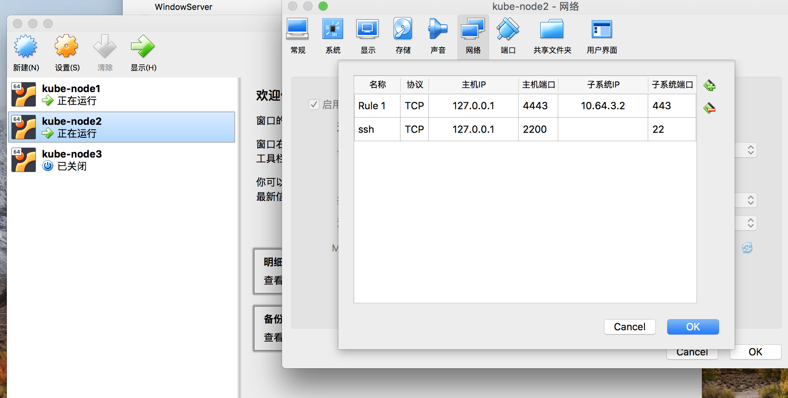
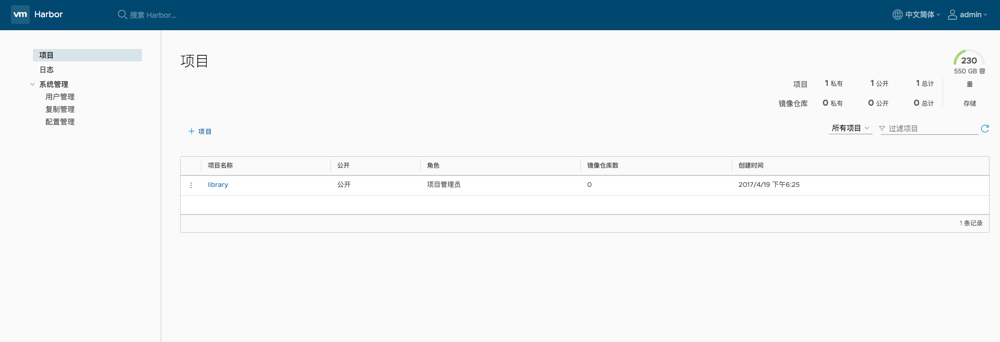

tags: registry, harbor

# D. 部署 harbor 私有仓库

<!-- TOC -->

- [D. 部署 harbor 私有仓库](#d-部署-harbor-私有仓库)
    - [使用的变量](#使用的变量)
    - [下载文件](#下载文件)
    - [导入 docker images](#导入-docker-images)
    - [创建 harbor nginx 服务器使用的 x509 证书](#创建-harbor-nginx-服务器使用的-x509-证书)
    - [修改 harbor.cfg 文件](#修改-harborcfg-文件)
    - [加载和启动 harbor 镜像](#加载和启动-harbor-镜像)
    - [访问管理界面](#访问管理界面)
    - [harbor 运行时产生的文件、目录](#harbor-运行时产生的文件目录)
    - [docker 客户端登陆](#docker-客户端登陆)
    - [其它操作](#其它操作)

<!-- /TOC -->

本文档介绍使用 docker-compose 部署 harbor 私有仓库的步骤，你也可以使用 docker 官方的 registry 镜像部署私有仓库([部署 Docker Registry](11-部署Docker-Registry.md))。

## 使用的变量

本文档用到的变量定义如下：

``` bash
$ export NODE_IP=10.64.3.7 # 当前部署 harbor 的节点 IP
$
```

## 下载文件

从 docker compose [发布页面](https://github.com/docker/compose/releases)下载最新的 `docker-compose` 二进制文件

``` bash
$ wget https://github.com/docker/compose/releases/download/1.21.2/docker-compose-Linux-x86_64
$ mv ~/docker-compose-Linux-x86_64 /opt/k8s/bin/docker-compose
$ chmod a+x  /opt/k8s/bin/docker-compose
$ export PATH=/opt/k8s/bin:$PATH
$
```

从 harbor [发布页面](https://github.com/vmware/harbor/releases)下载最新的 harbor 离线安装包

``` bash
$ wget  --continue https://storage.googleapis.com/harbor-releases/release-1.5.0/harbor-offline-installer-v1.5.1.tgz
$ tar -xzvf harbor-offline-installer-v1.5.1.tgz
$
```

## 导入 docker images

导入离线安装包中 harbor 相关的 docker images：

``` bash
$ cd harbor
$ docker load -i harbor.v1.5.1.tar.gz
$
```

## 创建 harbor nginx 服务器使用的 x509 证书

创建 harbor 证书签名请求：

``` bash
$ cat > harbor-csr.json <<EOF
{
  "CN": "harbor",
  "hosts": [
    "127.0.0.1",
    "${NODE_IP}"
  ],
  "key": {
    "algo": "rsa",
    "size": 2048
  },
  "names": [
    {
      "C": "CN",
      "ST": "BeiJing",
      "L": "BeiJing",
      "O": "k8s",
      "OU": "opsnull"
    }
  ]
}
EOF
```

+ hosts 字段指定授权使用该证书的当前部署节点 IP，如果后续使用域名访问 harbor 则还需要添加域名；

生成 harbor 证书和私钥：

``` bash
$ cfssl gencert -ca=/etc/kubernetes/cert/ca.pem \
  -ca-key=/etc/kubernetes/cert/ca-key.pem \
  -config=/etc/kubernetes/cert/ca-config.json \
  -profile=kubernetes harbor-csr.json | cfssljson -bare harbor

$ ls harbor*
harbor.csr  harbor-csr.json  harbor-key.pem harbor.pem

$ sudo mkdir -p /etc/harbor/ssl
$ sudo mv harbor*.pem /etc/harbor/ssl
$ rm harbor.csr  harbor-csr.json
```

## 修改 harbor.cfg 文件

``` bash
$ cp harbor.cfg{,.bak}
$ vim harbor.cfg
$ diff harbor.cfg{,.bak}
7c7
< hostname = 172.27.129.81
---
> hostname = reg.mydomain.com
11c11
< ui_url_protocol = https
---
> ui_url_protocol = http
23,24c23,24
< ssl_cert =  /etc/harbor/ssl/harbor.pem
< ssl_cert_key = /etc/harbor/ssl/harbor-key.pem
---
> ssl_cert = /data/cert/server.crt
> ssl_cert_key = /data/cert/server.key

$ cp prepare{,.bak}
$ vim prepare
$ diff prepare{,.bak}
453a454
>         print("%s %w", args, kw)
490c491
<     empty_subj = "/"
---
>     empty_subj = "/C=/ST=/L=/O=/CN=/"

```
+ 需要修改 prepare 脚本的 empyt_subj 参数，否则后续 install 时出错退出：
  
    Fail to generate key file: ./common/config/ui/private_key.pem, cert file: ./common/config/registry/root.crt

参考：https://github.com/vmware/harbor/issues/2920

## 加载和启动 harbor 镜像

``` bash
$ sudo mkdir /data
$ sudo chmod 777 /var/run/docker.sock /data
$ sudo apt-get install python
$ ./install.sh

[Step 0]: checking installation environment ...

Note: docker version: 18.03.0

Note: docker-compose version: 1.21.2

[Step 1]: loading Harbor images ...
Loaded image: vmware/clair-photon:v2.0.1-v1.5.1
Loaded image: vmware/postgresql-photon:v1.5.1
Loaded image: vmware/harbor-adminserver:v1.5.1
Loaded image: vmware/registry-photon:v2.6.2-v1.5.1
Loaded image: vmware/photon:1.0
Loaded image: vmware/harbor-migrator:v1.5.1
Loaded image: vmware/harbor-ui:v1.5.1
Loaded image: vmware/redis-photon:v1.5.1
Loaded image: vmware/nginx-photon:v1.5.1
Loaded image: vmware/mariadb-photon:v1.5.1
Loaded image: vmware/notary-signer-photon:v0.5.1-v1.5.1
Loaded image: vmware/harbor-log:v1.5.1
Loaded image: vmware/harbor-db:v1.5.1
Loaded image: vmware/harbor-jobservice:v1.5.1
Loaded image: vmware/notary-server-photon:v0.5.1-v1.5.1


[Step 2]: preparing environment ...
loaded secret from file: /data/secretkey
Generated configuration file: ./common/config/nginx/nginx.conf
Generated configuration file: ./common/config/adminserver/env
Generated configuration file: ./common/config/ui/env
Generated configuration file: ./common/config/registry/config.yml
Generated configuration file: ./common/config/db/env
Generated configuration file: ./common/config/jobservice/env
Generated configuration file: ./common/config/jobservice/config.yml
Generated configuration file: ./common/config/log/logrotate.conf
Generated configuration file: ./common/config/jobservice/config.yml
Generated configuration file: ./common/config/ui/app.conf
Generated certificate, key file: ./common/config/ui/private_key.pem, cert file: ./common/config/registry/root.crt
The configuration files are ready, please use docker-compose to start the service.


[Step 3]: checking existing instance of Harbor ...


[Step 4]: starting Harbor ...
Creating network "harbor_harbor" with the default driver
Creating harbor-log ... done
Creating redis              ... done
Creating harbor-adminserver ... done
Creating harbor-db          ... done
Creating registry           ... done
Creating harbor-ui          ... done
Creating harbor-jobservice  ... done
Creating nginx              ... done

✔ ----Harbor has been installed and started successfully.----

Now you should be able to visit the admin portal at https://172.27.129.81.
For more details, please visit https://github.com/vmware/harbor .
```

## 访问管理界面

确认所有组件都工作正常：

``` bash
$ docker-compose  ps
       Name                     Command                  State                                    Ports
-------------------------------------------------------------------------------------------------------------------------------------
harbor-adminserver   /harbor/start.sh                 Up (healthy)
harbor-db            /usr/local/bin/docker-entr ...   Up (healthy)   3306/tcp
harbor-jobservice    /harbor/start.sh                 Up
harbor-log           /bin/sh -c /usr/local/bin/ ...   Up (healthy)   127.0.0.1:1514->10514/tcp
harbor-ui            /harbor/start.sh                 Up (healthy)
nginx                nginx -g daemon off;             Up (healthy)   0.0.0.0:443->443/tcp, 0.0.0.0:4443->4443/tcp, 0.0.0.0:80->80/tcp
redis                docker-entrypoint.sh redis ...   Up             6379/tcp
registry             /entrypoint.sh serve /etc/ ...   Up (healthy)   5000/tcp
```

浏览器访问 `https://${NODE_IP}`，示例的是 `https://172.27.129.81`；

由于是在 virtualbox 虚机 zhangjun-k8s-02 中运行，所以需要做下端口转发，Vagrant 文件中已经指定 host 端口为 4443，也可以在 virtualbox 的 GUI 中直接添加端口转发：



浏览器访问 `https://127.0.0.1:443`，用账号 `admin` 和 harbor.cfg 配置文件中的默认密码 `Harbor12345` 登陆系统。



## harbor 运行时产生的文件、目录

harbor 将日志打印到 /var/log/harbor 的相关目录下，使用 docker logs XXX 或 docker-compose logs XXX 将看不到容器的日志。

``` bash
$ # 日志目录
$ ls /var/log/harbor
adminserver.log  jobservice.log  mysql.log  proxy.log  registry.log  ui.log
$ # 数据目录，包括数据库、镜像仓库
$ ls /data/
ca_download  config  database  job_logs registry  secretkey
```

## docker 客户端登陆

将签署 harbor 证书的 CA 证书拷贝到 `/etc/docker/certs.d/172.27.129.81` 目录下

``` bash
$ sudo mkdir -p /etc/docker/certs.d/172.27.129.81
$ sudo cp /etc/kubernetes/cert/ca.pem /etc/docker/certs.d/172.27.129.81/ca.crt
$
```

登陆 harbor

``` bash
$ docker login 172.27.129.81
Username: admin
Password:
```

认证信息自动保存到 `~/.docker/config.json` 文件。

## 其它操作

下列操作的工作目录均为 解压离线安装文件后 生成的 harbor 目录。

``` bash
$ # 停止 harbor
$ docker-compose down -v
$ # 修改配置
$ vim harbor.cfg
$ # 更修改的配置更新到 docker-compose.yml 文件
$ ./prepare
Clearing the configuration file: ./common/config/ui/app.conf
Clearing the configuration file: ./common/config/ui/env
Clearing the configuration file: ./common/config/ui/private_key.pem
Clearing the configuration file: ./common/config/db/env
Clearing the configuration file: ./common/config/registry/root.crt
Clearing the configuration file: ./common/config/registry/config.yml
Clearing the configuration file: ./common/config/jobservice/app.conf
Clearing the configuration file: ./common/config/jobservice/env
Clearing the configuration file: ./common/config/nginx/cert/admin.pem
Clearing the configuration file: ./common/config/nginx/cert/admin-key.pem
Clearing the configuration file: ./common/config/nginx/nginx.conf
Clearing the configuration file: ./common/config/adminserver/env
loaded secret from file: /data/secretkey
Generated configuration file: ./common/config/nginx/nginx.conf
Generated configuration file: ./common/config/adminserver/env
Generated configuration file: ./common/config/ui/env
Generated configuration file: ./common/config/registry/config.yml
Generated configuration file: ./common/config/db/env
Generated configuration file: ./common/config/jobservice/env
Generated configuration file: ./common/config/jobservice/app.conf
Generated configuration file: ./common/config/ui/app.conf
Generated certificate, key file: ./common/config/ui/private_key.pem, cert file: ./common/config/registry/root.crt
The configuration files are ready, please use docker-compose to start the service.
$ sudo chmod -R 666 common ## 防止容器进程没有权限读取生成的配置
$ # 启动 harbor
$ docker-compose up -d
```