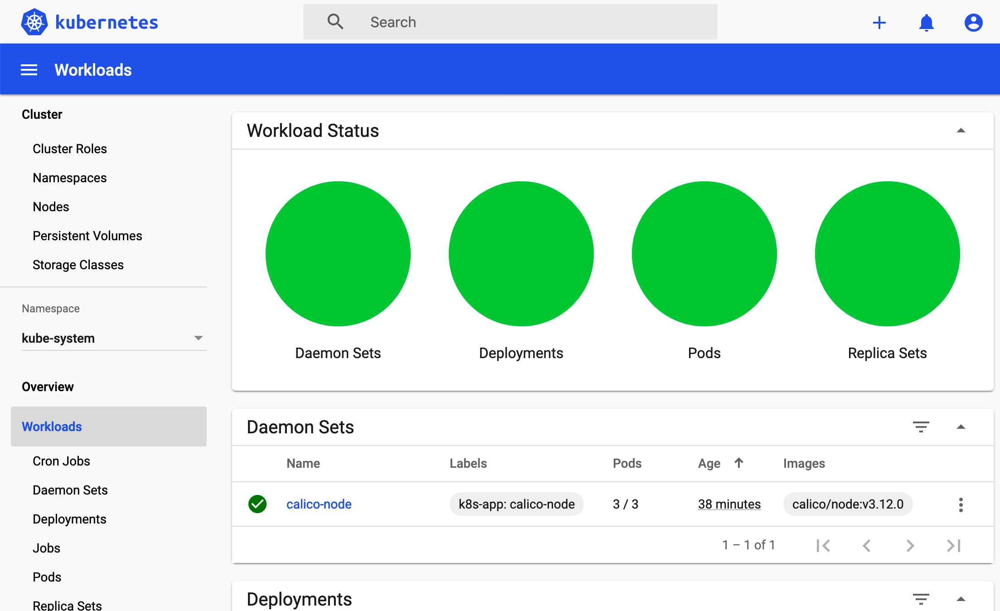

# 和我一步步部署 kubernetes 集群

本系列文档介绍使用二进制部署最新 `kubernetes v1.10.4` 集群的所有步骤，而不是使用 `kubeadm` 等自动化方式来部署集群。

在部署的过程中，将详细列出各组件的启动参数，它们的含义和可能遇到的问题。

部署完成后，你将理解系统各组件的交互原理，进而能快速解决实际问题。

所以本文档主要适合于那些有一定 kubernetes 基础，想通过一步步部署的方式来学习和了解系统配置、运行原理的人。

本系列系文档适用于 `CentOS 7`、`Ubuntu 16.04` 及以上版本系统，**随着各组件的更新而更新**，有任何问题欢迎提 issue！

由于启用了 `x509` 证书双向认证、`RBAC` 授权等严格的安全机制，建议**从头开始部署**，否则可能会认证、授权等失败！

## 历史版本

[v1.6.2](https://github.com/opsnull/follow-me-install-kubernetes-cluster/tree/v1.6.2)

## 步骤列表

1. [00.组件版本和配置策略](00.组件版本和配置策略.md)
1. [01.系统初始化和全局变量](01.系统初始化和全局变量.md)
1. [02.创建CA证书和秘钥](02.创建CA证书和秘钥.md)			
1. [03.部署kubectl命令行工具](03.部署kubectl命令行工具.md)			
1. [04.部署etcd集群](04.部署etcd集群.md)				
1. [05.部署flannel网络](05.部署flannel网络.md)			
1. [06.部署master节点](06-0.部署master节点.md)				
    1. [06-1.api-server](06-1.api-server.md)	
    1. [06-2.controller-manager集群](06-2.controller-manager集群.md)
    1. [06-3.scheduler集群](06-3.scheduler集群.md)		
1. [07.部署worker节点](07-0.部署worker节点.md)
    1. [07-1.docker](07-1.docker.md)					
    1. [07-2.kubelet](07-2.kubelet.md)				
    1. [07-3.kube-proxy](07-3.kube-proxy.md)			
1. [08.验证集群功能](08.验证集群功能.md)			
1. [09.部署集群插件](09-0.部署集群插件.md)
    1. [09-1.dns插件](09-1.dns插件.md)
    1. [09-2.dashboard插件](09-2.dashboard插件.md)
    1. [09-3.heapster插件](09-3.heapster插件.md)
    1. [09-4.metrics-server插件](09-4.metrics-server插件.md)
    1. [09-5.EFK插件](09-5.EFK插件.md)			
1. [10.部署Docker-Registry](10.部署Docker-Registry.md)	
1. [11.部署Harbor-Registry](11.部署Harbor-Registry.md)	
1. [12.清理集群](12.清理集群.md)
1. [A.浏览器访问apiserver安全端口](A.浏览器访问kube-apiserver安全端口.md)

## 在线阅读

+ 建议：[GitBook](https://k8s-install.opsnull.com/)
+ [Github](https://www.gitbook.com/book/opsnull/follow-me-install-kubernetes-cluster)

## 电子书

+ pdf 格式 [下载](https://www.gitbook.com/download/pdf/book/opsnull/follow-me-install-kubernetes-cluster)
+ epub 格式 [下载](https://www.gitbook.com/download/epub/book/opsnull/follow-me-install-kubernetes-cluster)

## 打赏

如果你觉得这份文档对你有帮助，请微信扫描下方的二维码进行捐赠，加油后的 opsnull 将会和你分享更多的原创教程，谢谢！

  

## 技术咨询

有问题，欢迎在 Github 提 issue！如果想获得更及时、专业、一对一的咨询服务，请先用微信扫描下方的二维码，然后加 QQ 574419270 进行咨询(请注明：K8S 技术咨询)，谢谢！

  

## 版权

Copyright 2017-2018 zhangjun (geekard@qq.com)

知识共享 署名-非商业性使用-相同方式共享 4.0（CC BY-NC-SA 4.0），详情见 [LICENSE](LICENSE) 文件。